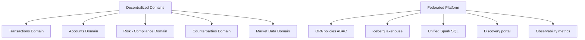

# ADR-0001: Data Mesh Pattern for Decentralized Ownership

**Status**: Accepted | **Date**: 2026-04-01

---

## Context

The organization has multiple business domains (Transactions, Accounts, Risk/Compliance, Counterparties, Market Data) with different data velocity, freshness requirements, and compliance needs. Traditional centralized data warehouses create bottlenecks:

1. **Schema bottleneck**: All schema changes must be approved by a central team
2. **Compliance friction**: One governance model doesn't fit PCI-DSS (transactions) + AML (compliance) + GDPR (accounts)
3. **SLA misalignment**: Risk data needs 10-minute freshness; market data needs 1-minute; they can't share infrastructure
4. **Scaling**: Adding new domains requires coordination with the central platform

---

## Decision

**Adopt the data mesh pattern**: Each domain owns its data end-to-end (schema, ingest, SLAs, governance), while a federated platform enforces consistent policies.



### Governance Model
- **Domains own**: Schema, ingest jobs, SLAs, quality rules
- **Platform owns**: Policy enforcement (OPA), discovery catalog, observability, storage abstraction

### Data Products
Each domain publishes a **data product** with an explicit contract:
```yaml
name: transaction-feed
sla:
  freshness: 5 minutes
  availability: 99.9%
access_policy:
  default: deny
  masking: [account_id, account_holder_name]
retention: 7 years (SOX)
quality_rules: [positive_amount, valid_settlement_date]
```

---

## Rationale

**Why data mesh over centralized warehouse?**

1. **Speed**: Domains iterate independently (no schema review bottleneck)
2. **Compliance alignment**: Each domain's policies match its regulations
3. **SLA flexibility**: Transactions = 5-min freshness, Market Data = 1-min freshness
4. **Scalability**: Add new domains without changing platform
5. **Accountability**: Domain owns freshness SLA; domain on-call if data is stale

**Why federated governance?**
- Decentralization without chaos (policies enforce consistency)
- Policy-as-code enables testing and versioning
- Single source of truth for access rules (OPA policies)

---

## Consequences

### Positive
- ✅ Domain teams move fast (no central team bottleneck)
- ✅ Compliance policies are explicit and testable
- ✅ Real-time and batch systems coexist (different SLAs)
- ✅ Clear accountability (domain owns SLA)

### Negative (Trade-offs)
- ❌ Coordination overhead (domains must publish consistent contracts)
- ❌ Policy fragmentation (need guidelines to prevent policy chaos)
- ❌ Operational complexity (5 domains = 5 ingest jobs, 5 monitoring systems)
- ❌ Data lineage harder to track (data scattered across domains)

### Operational Impact
- **Onboarding**: New domain = define schema + ingest job + data product YAML = 3-5 days
- **Monitoring**: 5 Kafka topics, 5 Spark jobs, 5 Iceberg tables to monitor
- **Governance**: OPA policies must be maintained (policy language learning curve)

---

## Alternatives Considered

### Alternative 1: Centralized Data Warehouse (Rejected)
**Pros**: Single source of truth, simpler ops
**Cons**: 
- Schema review bottleneck (3-week cycle)
- One-size-fits-all SLAs (can't meet both 1-min and 10-min freshness)
- Compliance friction (multiple regulations, one model)
- Rejected because: Doesn't scale for fintech complexity

### Alternative 2: Pure Data Lake (No Governance) (Rejected)
**Pros**: Fast to onboard
**Cons**:
- No access control (compliance risk)
- No masking (PII exposed)
- Data quality unknown (no SLAs)
- Rejected because: Non-compliant for fintech

### Alternative 3: Domain Ownership + Centralized Catalog (Considered)
Similar to data mesh, but central team manages all policies.
**Rejected because**: Reintroduces central bottleneck; defeats purpose of decentralization

---

## Validation

**How will we know this works?**

1. **Speed metric**: New domain onboarding < 5 days (target: 3 days)
2. **Compliance**: All access decisions audited; 100% masking enforcement
3. **SLA compliance**: Transactions = 5-min, Market Data = 1-min (both met)
4. **Adoption**: >80% of analytics queries use discovery portal

**Success criteria (6 months)**:
- ✅ 5 domains operational with independent SLAs
- ✅ Zero PII leaks (100% masking enforcement)
- ✅ Access approval SLA met 100% of the time
- ✅ Freshness SLAs met 99%+ of the time

---

## Related Decisions

- **[ADR-0002](ADR-0002-iceberg.md)**: Why Iceberg supports domain ownership (schema evolution without rewrites)
- **[ADR-0003](ADR-0003-governance.md)**: Why OPA policies enforce consistency without central control
- **[ADR-0004](ADR-0004-real-time.md)**: Why Kafka + Iceberg enable different SLAs per domain

---

## References

- **Data Mesh Learning**: https://www.datamesh-learning.com/
- **Domain-Driven Design**: Eric Evans, "Domain-Driven Design: Tackling Complexity..."
- **Gartner on Data Mesh**: https://www.gartner.com/smarterwithgartner/...

---

## Sign-Off

| Role | Name | Date | Status |
|------|------|------|--------|
| Architecture Lead | - | 2026-04-01 | Approved |
| Compliance Officer | - | 2026-04-01 | Approved |
| Platform Lead | - | 2026-04-01 | Approved |
