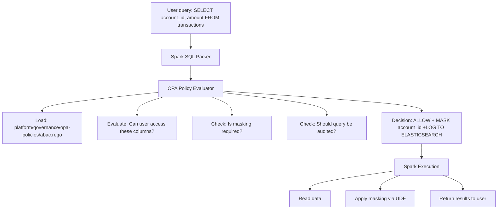

# ADR-0003: OPA (Open Policy Agent) for Federated Governance

**Status**: Accepted | **Date**: 2026-04-08

---

## Context

Data mesh pattern requires federated governance: consistent compliance policies without central control. But how do we enforce:
- **PII masking** (account_id visible to risk analysts, masked for external analysts)
- **Approval workflows** (restricted data requires 2-hour approval)
- **Retention policies** (transactions must retain 7 years)
- **Audit trails** (all queries logged)

Traditional approaches:
1. **Role-based access (RBAC)**: "analyst" role has read access. Breaks at scale (100+ roles).
2. **Embedded in application code**: Compliance logic scattered across services. Hard to audit.
3. **SQL Row-Level Security**: Database-specific, hard to extend across tools.

---

## Decision

**Choose OPA (Open Policy Agent)** for policy-as-code governance.

### How It Works



### Policy Example
```rego
# Default deny
default allow = false

# Analysts can read public data
allow {
  input.user_role == "analyst"
  input.action == "read"
  input.data_classification != "restricted"
}

# Mask PII for external users
apply_masking[reason] {
  input.user_role == "external_analyst"
  input.column_classification == "pii"
  reason := "external_analyst viewing PII"
  masking_strategy := "full_hash"
}
```

---

## Rationale

### Why OPA Over Alternatives?

#### Alternative 1: RBAC (Role-Based Access Control)
**Cons**:
- Doesn't scale (new data type = new role combination)
- Can't express complex rules ("read-only analyst + PII = masked")
- Hard to change rules dynamically

**OPA advantage**: Attribute-based rules scale to new domains/data types automatically.

#### Alternative 2: Embedded in Code
**Cons**:
- Compliance scattered across services
- Hard to audit ("is access control correct?")
- Can't change rules without deployment

**OPA advantage**: Policies centralized, testable, version-controlled.

#### Alternative 3: Database-Level Security
**Cons**:
- SQL doesn't support complex rules easily
- Doesn't work across multiple databases (Iceberg, Elasticsearch, etc.)
- Database-team bottleneck for policy changes

**OPA advantage**: Works across any system (Spark, Presto, Trino, APIs, etc.).

### Key Benefits

1. **Policy-as-Code**
```rego
# Policy is testable
test_allow_analyst_public {
  authz.allow with input as {
    "user_role": "analyst",
    "action": "read",
    "data_classification": "public"
  }
}
```

2. **Decoupled from Code**
```python
# Application doesn't know about compliance rules
user_query = "SELECT * FROM transactions"
# OPA applies rules transparently
```

3. **Version-Controlled**
```bash
git log platform/governance/opa-policies/abac.rego
# See history of policy changes
```

4. **Extensible**
```rego
# Add new rule for GDPR right-to-deletion
enforce_deletion_request {
  input.action == "delete"
  input.user_role == "privacy_officer"
  deletion_request_approved := true
}
```

---

## Consequences

### Positive
- ✅ Compliance rules are testable and auditable
- ✅ Policies can change without code deployment
- ✅ Works across Spark, Presto, APIs, etc.
- ✅ Attribute-based (scales to new domains)
- ✅ Decisions logged (audit trail)

### Negative (Trade-offs)
- ❌ Learning curve (Rego language)
- ❌ Performance overhead (policy evaluation on every query)
- ❌ Debugging harder (policy logic can be complex)
- ❌ Requires discipline (policies must be tested)

---

## Alternatives Considered

### Alternative 1: Apache Ranger
**Pros**: Integrated with Hadoop ecosystem
**Cons**:
- Complex setup
- Ranger-specific (less portable)
- Learning curve similar to OPA
- **Rejected**: OPA simpler and more portable

### Alternative 2: Attribute-Based Access Control (ABAC) from scratch
**Pros**: Custom-built to needs
**Cons**:
- Reinventing wheel (OPA already does this)
- Maintenance burden
- **Rejected**: OPA is proven, battle-tested

### Alternative 3: No Federated Governance (Each Domain Manages Access)
**Pros**: Decentralized
**Cons**:
- Policy fragmentation (5 domains = 5 policy variants)
- Audit risk (hard to verify compliance)
- Inconsistency (same data masking rule implemented 5 ways)
- **Rejected**: Defeats purpose of federated governance

---

## Implementation

### Policy Structure
```
platform/governance/opa-policies/
├── abac.rego (Attribute-Based Access Control)
├── masking.rego (PII/sensitive data masking)
├── retention.rego (Data retention enforcement)
├── audit.rego (Audit trail requirements)
└── test/ (Unit tests for policies)
```

### Integration with Spark
```python
# Query interceptor evaluates OPA policy
class OPAInterceptor:
    def intercept_query(self, user_id, query):
        # Parse columns
        columns = self.extract_columns(query)
        
        # Evaluate OPA policy for each column
        for col in columns:
            decision = requests.post(
                "http://opa:8181/v1/data/authz",
                json={"input": {
                    "user_id": user_id,
                    "column": col,
                    "action": "read"
                }}
            )
            
            if decision["allow"] == False:
                raise AccessDenied(f"Cannot access {col}")
            
            if decision.get("masking_required"):
                query = self.apply_masking(query, col, decision["strategy"])
        
        return query
```

---

## Monitoring & Validation

### Policy Testing
```bash
opa test platform/governance/opa-policies/
# Output: 45 tests, 45 passed, 0 failed
```

### Audit of Policy Decisions
```sql
-- Query Elasticsearch for all policy decisions
SELECT user_id, data_table, allowed, masked_columns, timestamp
FROM policy_decisions_audit
WHERE timestamp > now() - INTERVAL 24 hours
ORDER BY timestamp DESC;
```

### Performance Monitoring
```
Metric: opa_evaluation_duration_seconds
Threshold: P95 < 50ms (policy evaluation should be fast)
Alert if: P95 > 100ms (indicates policy complexity issue)
```

---

## Success Criteria

- ✅ All PII consistently masked across systems
- ✅ Approval SLAs met 100% (no manual workarounds)
- ✅ Policies testable and version-controlled
- ✅ Policy changes don't require code deployment

---

## References

- OPA Documentation: https://www.openpolicyagent.org/
- OPA Rego Language: https://www.openpolicyagent.org/docs/latest/policy-language/
- ABAC vs RBAC: https://www.cloudentity.com/blog/abac-vs-rbac/

---

## Sign-Off

| Role | Name | Date | Status |
|------|------|------|--------|
| Compliance Officer | - | 2026-04-08 | Approved |
| Platform Lead | - | 2026-04-08 | Approved |
| Security Lead | - | 2026-04-08 | Approved |
