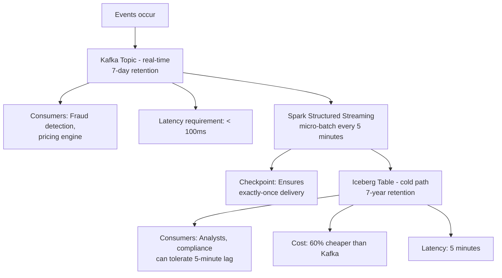
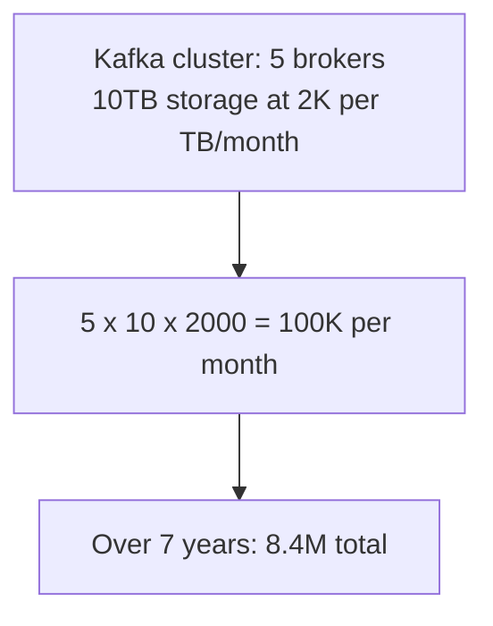
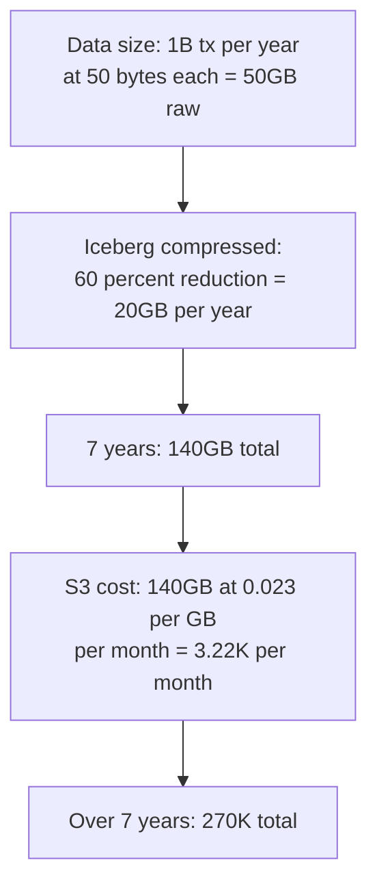
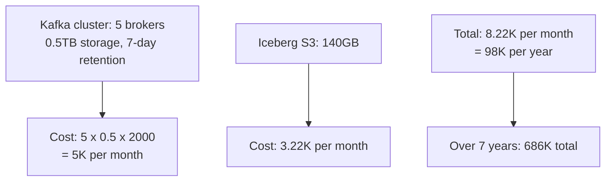
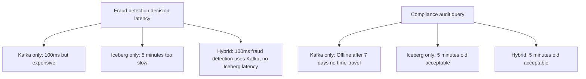

# ADR-0004: Hybrid Kafka + Iceberg Strategy for Real-Time and Analytics

**Status**: Accepted | **Date**: 2026-04-12

---

## Context

Data mesh supports multiple domains with conflicting freshness requirements:

| Domain | Need | SLA | Why |
|--------|------|-----|-----|
| **Transactions** | Balance updates, fraud detection | 5 min | Fraud detection can't wait hours |
| **Accounts** | Account master data | 10 min | Less critical than transactions |
| **Market Data** | FX rates for risk models | 1 min | Pricing can't lag by hours |
| **Risk/Compliance** | Fraud scores | 10 min | Longer acceptable |
| **Counterparties** | Merchant master data | 60 min | Very low velocity |

**The problem**: Real-time streaming (Kafka) is expensive at 7-year retention. Batch storage (Iceberg) is cheap but has high latency.

Can we have both?

---

## Decision

**Adopt hybrid strategy: Kafka (hot path) + Iceberg (cold path)**



### Trade-Off
- **Hot path (Kafka)**: Real-time, expensive, short retention
- **Cold path (Iceberg)**: Batch, cheap, long retention
- **Sweet spot**: Real-time freshness for critical systems + cost-optimized storage for compliance

---

## Rationale

### Pure Kafka (Rejected)
**Pros**:
- ✅ Sub-second latency for fraud detection
- ✅ Real-time streaming

**Cons**:
- ❌ 7-year retention = $500K+/year in Kafka cluster costs
- ❌ Can't run analytical queries easily
- ❌ No time-travel for audits
- **Verdict**: Too expensive; doesn't support compliance needs

### Pure Iceberg (Rejected)
**Pros**:
- ✅ Cost-optimized (columnar compression)
- ✅ Supports compliance (time-travel, long retention)
- ✅ Analytical queries fast

**Cons**:
- ❌ 5-minute micro-batch lag (fraud detection needs < 1 second)
- ❌ Missing transactions during batch window
- **Verdict**: Too slow for operational systems

### Hybrid (Accepted)
**Pros**:
- ✅ Real-time for fraud detection (< 100ms via Kafka)
- ✅ Cost-optimized for compliance (< $2.5K/month via Iceberg)
- ✅ Operational + analytical systems coexist
- ✅ Clear separation of concerns

**Cons**:
- ⚠️ Operational complexity (two systems to manage)
- ⚠️ Data consistency (Kafka 5 min ahead of Iceberg possible)

---

## Cost Analysis

### Scenario: 1B transactions/year × 7-year retention

**Option 1: Pure Kafka** (7-day retention, cluster costs)



**Option 2: Pure Iceberg** (7-year retention, S3 storage)



**Option 3: Hybrid Kafka 7-day + Iceberg 7-year**



**Savings**: Hybrid is 31x cheaper than pure Kafka, 2.5x more expensive than pure Iceberg but 31x faster for fraud detection.

### Latency Trade-Off



---

## Design Details

### Exactly-Once Semantics

Spark Structured Streaming guarantees exactly-once delivery:

```python
# Spark reads from Kafka
df = spark.readStream.format("kafka") \
    .option("kafka.bootstrap.servers", "kafka:9092") \
    .option("subscribe", "transactions-raw") \
    .load()

# Spark writes to Iceberg atomically
query = df.writeStream \
    .format("iceberg") \
    .mode("append") \
    .option("checkpointLocation", "/checkpoint/transactions") \
    .toTable("transactions.raw_transactions")

query.awaitTermination()
```

**How it works**:
1. Spark reads batch from Kafka (offset 1000-1144)
2. Writes to temp Iceberg files
3. Creates atomic snapshot (one operation)
4. Job crashes → temp files lost, snapshot not updated
5. Restart reads checkpoint (offset 1000) → no duplicates

### Handling Late-Arriving Data

Some events may arrive late to Kafka (network delay, provider backfill):

```python
# Filter old events (max 5 minutes late)
df = df.filter(col("timestamp") > unix_timestamp() - 300)

# Or use MERGE for updates if same transaction arrives with correction
```

---

## Consequences

### Positive
- ✅ Real-time operations possible (fraud detection < 100ms)
- ✅ Cost-optimized for long retention (< $10K/month)
- ✅ Analytical queries fast (Iceberg columnar)
- ✅ Exactly-once semantics (no duplicates)
- ✅ Time-travel for audits (Iceberg snapshots)

### Negative (Trade-offs)
- ❌ Operational complexity (manage Kafka + Iceberg + Spark)
- ❌ Potential data lag (Kafka 5 minutes ahead of Iceberg possible)
- ❌ Two-system consistency (need to explain to data consumers)
- ❌ Monitoring both paths (duplicate SLA dashboards)

---

## Alternatives Considered

### Alternative 1: Event Sourcing (Store All Events Forever)
**Pros**: Complete audit trail
**Cons**:
- Expensive (store every event for 7 years)
- Query complexity (reconstruct state from events)
- **Rejected**: Overkill for fintech; Iceberg time-travel sufficient

### Alternative 2: Kafka + NoSQL (Real-time Store)
**Pros**: Real-time consistency
**Cons**:
- Two storage systems (Kafka + NoSQL)
- Query complexity (join across systems)
- Cost higher than Kafka + Iceberg
- **Rejected**: Iceberg better for analytics

### Alternative 3: Stream Processing Framework (Flink)
**Pros**: Lower latency (continuous processing vs. micro-batch)
**Cons**:
- Operational complexity (Flink cluster management)
- Cost similar to Kafka + Spark
- Spark already being used
- **Rejected**: Kafka + Spark sufficient; Flink overkill

### Alternative 4: Pub/Sub Managed Service (AWS Kinesis, GCP Pubsub)
**Pros**: Fully managed
**Cons**:
- Vendor lock-in
- Cost higher at scale
- Can't use open-source tools
- **Rejected**: Kafka gives portability; Iceberg is open

---

## Implementation Checklist

- [ ] Kafka topics created per domain (with 7-day retention)
- [ ] Schema Registry configured (Avro schemas per domain)
- [ ] Spark ingest jobs deployed (TransactionIngestJob, etc.)
- [ ] Iceberg tables created with correct partitions
- [ ] Checkpoints configured for fault tolerance
- [ ] Freshness SLA monitoring in place
- [ ] Kafka lag monitoring dashboard
- [ ] Iceberg compaction jobs scheduled
- [ ] Data quality checks integrated

---

## Monitoring

**Hot path (Kafka) metrics**:
```
kafka_lag_seconds{domain="transactions"}: Should be < 30 sec
kafka_consumer_lag{topic="transactions-raw"}: Should be < 1000 messages
```

**Cold path (Iceberg) metrics**:
```
data_freshness_minutes{table="raw_transactions"}: Should be < 5 min
iceberg_snapshot_age{table="raw_transactions"}: Should be < 5 min
```

**Consistency check** (optional):
```sql
-- Compare hot and cold counts (should match within tolerance)
SELECT
  COUNT(*) as kafka_count,
  (SELECT COUNT(*) FROM transactions.raw_transactions) as iceberg_count,
  ABS(kafka_count - iceberg_count) / kafka_count as pct_diff
FROM kafka_topic_transactions_raw;
-- Expect: pct_diff < 0.1% (100.1% - 100% due to micro-batch lag)
```

---

## Success Criteria

- ✅ Fraud detection latency < 100ms (hot path SLA)
- ✅ Iceberg freshness < 5 minutes (cold path SLA)
- ✅ Total cost < $10K/month (hot + cold paths)
- ✅ Zero data loss (exactly-once delivery)
- ✅ Time-travel queries work for audits

---

## References

- Kafka Exactly-Once: https://kafka.apache.org/documentation/#semantics
- Spark Structured Streaming: https://spark.apache.org/docs/latest/structured-streaming-programming-guide.html
- Iceberg Commit Protocol: https://iceberg.apache.org/spec/

---

## Sign-Off

| Role | Name | Date | Status |
|------|------|------|--------|
| Architecture Lead | - | 2026-04-12 | Approved |
| Operations Lead | - | 2026-04-12 | Approved |
| Finance (Cost Review) | - | 2026-04-12 | Approved |
