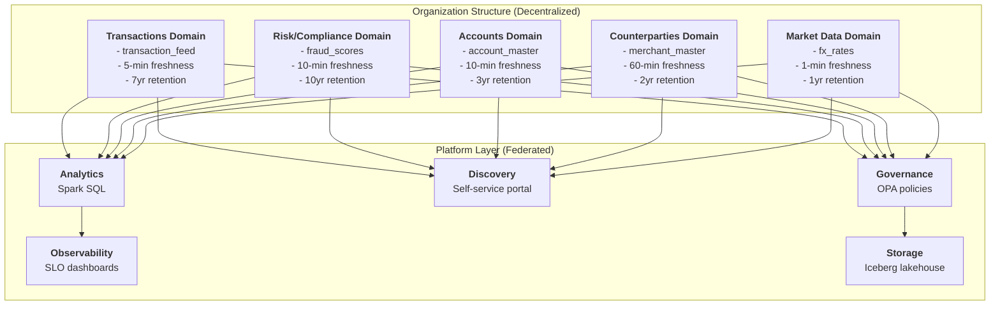

# Architecture Overview

## The Data Mesh Pattern

Traditional data warehouses centralize ownership: one platform, one catalog, one security model, one schema review committee. This creates bottlenecks that fintech organizations feel acutely—compliance policies differ per domain, SLAs vary by data sensitivity, and schema changes block multiple teams.

**Data mesh flips this model:** each domain (Transactions, Risk/Compliance, Accounts) owns its data, schema, governance, and SLAs. A *federated governance layer* (OPA policies) replaces a centralized review board. Domains publish *data products*—formal contracts with SLAs, quality rules, and masking policies—that other teams consume.

The result: **decentralized speed with centralized compliance**.



---

## Why Data Mesh for Fintech?

### Problem 1: Compliance Complexity
Different data requires different policies:
- **Transactions** (PCI-DSS): Mask card numbers, encrypt in transit, 7-year SOX retention
- **Risk/Compliance** (AML): Audit trail required, 10-year retention, sanctions screening
- **Accounts** (GDPR): Right to deletion, data minimization, 3-year retention

A single centralized governance model forces compromises. Data mesh allows each domain to define policies matching its regulatory requirements.

### Problem 2: Latency vs Cost
Real-time systems need low latency; analytics needs cost-optimized storage. Centralized warehouses force a trade-off.

Data mesh uses a **hybrid approach**:
- **Hot path** (Kafka): Real-time freshness (1-5 min) for operational systems
- **Cold path** (Iceberg): Cost-optimized analytics with historical data and time-travel

Domains choose their freshness SLA independently.

### Problem 3: Schema Bottleneck
In centralized warehouses, schema changes require coordinating with a central team, blocking domain teams. With decentralized ownership:
- Each domain manages its own schema evolution
- Iceberg handles schema versioning without rewrites
- New domains can launch in days, not months

---

## Architecture Components

### 1. Domains (Decentralized Ownership)

Five autonomous domains manage their own data:

| Domain | Purpose | Tables | Freshness SLA | Retention |
|--------|---------|--------|---------------|-----------|
| **Transactions** | Core payment events | raw_transactions, settlement_status | 5 min | 7 years (SOX) |
| **Accounts** | Customer account master | accounts, account_balances | 10 min | 3 years |
| **Risk/Compliance** | Fraud, AML, regulatory scoring | fraud_scores, kyc_verdicts, sanctions_match | 10 min | 10 years (AML) |
| **Counterparties** | Merchants, banks, partners | merchants, bank_relationships | 60 min | 2 years |
| **Market Data** | FX rates, bonds, indices | fx_rates, bond_prices | 1 min | 1 year |

Each domain owns:
- **Schema definition** (Avro format, versioned)
- **Ingest job** (Spark Structured Streaming from Kafka)
- **Data product spec** (YAML with SLAs, quality rules, access policies)
- **Observability** (domain-specific metrics, freshness alerts)

### 2. Storage: Apache Iceberg Lakehouse

Iceberg provides the foundation for decentralized, compliance-aware analytics:

```
iceberg catalog
├── transactions (namespace)
│   ├── raw_transactions (ACID, v2.1 schema, 7-yr retention)
│   │   └── Partitions: [year, month, day, account_id]
│   └── settlement_status
│
├── risk_compliance (namespace)
│   ├── fraud_scores (audit-required, 10-yr retention)
│   └── kyc_verdicts (masking required, AML)
│
└── (accounts, counterparties, market_data namespaces)
```

**Why Iceberg?**
- **Schema evolution**: Add/drop/rename columns without rewrite
- **ACID transactions**: Exactly-once ingest, time-travel for audit
- **Cost**: Columnar compression, partition pruning, snapshot-based retention
- **Compliance**: Audit trails via transaction history, rollback capability

### 3. Real-Time Path: Kafka + Spark Structured Streaming

Each domain publishes events to Kafka with schema validation:

```
Transactions Domain publishes:
market-transactions-raw
├── Field: transaction_id, account_id, amount, merchant_id, ...
├── Schema: Avro v2.1 (Schema Registry)
├── Frequency: Real-time (as events occur)
└── Consumer: TransactionIngestJob (Spark Structured Streaming)

TransactionIngestJob:
├── Reads from Kafka topic
├── Validates schema (from_json + schema_of_json)
├── Deduplicates on transaction_id (exactly-once semantics)
├── Micro-batches to Iceberg every 5 minutes
└── Checkpoints for recovery (fault-tolerant)
```

**Result**: Kafka provides real-time freshness (1-5 min), Spark micro-batching + Iceberg checkpoints ensure exactly-once semantics.

### 4. Analytics Path: Unified Spark SQL

Analysts query across domains with a single Spark SQL engine:

```sql
-- Join transactions + risk scores (different domains, same SQL)
SELECT 
  t.transaction_id,
  t.amount,
  r.fraud_score,
  r.risk_level
FROM transactions.raw_transactions t
INNER JOIN risk_compliance.fraud_scores r
  ON t.transaction_id = r.transaction_id
WHERE t.booking_timestamp > now() - INTERVAL 7 days;

-- Time-travel query for audit (Iceberg feature)
SELECT * FROM transactions.raw_transactions
  FOR SYSTEM_TIME AS OF '2026-04-29 18:00:00'
WHERE transaction_id = '12345';
```

OPA policies silently apply masking:
- External analyst: account_holder_name → hash, merchant_id → partial
- Risk analyst: all columns visible
- Audit trail: logged to Elasticsearch

### 5. Federated Governance: OPA Policies

Instead of roles ("analyst", "admin"), policies evaluate attributes:

```rego
# Simplified OPA policy for data access
default allow = false

allow {
  input.user_role == "data_owner"
}

allow {
  input.user_role == "analyst"
  input.action == "read"
  input.data_classification != "restricted"
  not input.data_classification == "pii"  # No direct PII access
}

# Masking rule
mask_pii {
  input.data_classification == "pii"
  input.user_role == "external_analyst"
}
```

**Result**: Compliance rules are testable, versionable, and decoupled from application code.

### 6. Data Products: Formal Contracts

Each domain publishes a data product YAML specifying the contract:

```yaml
---
name: transaction-feed
version: "1.0"
domain: transactions
owner: transactions-domain

description: |
  Real-time transaction events for fraud detection, 
  settlement, and analytics.

tables:
  - name: raw_transactions
    iceberg_table: transactions.raw_transactions
    partitions: [year, month, day, account_id]

sla:
  freshness:
    value: 5
    unit: minutes
  availability:
    value: 99.9
    unit: percent
  completeness:
    value: 99
    unit: percent

access_policy:
  default: deny
  approval_required: false
  columns:
    - name: account_holder_name
      classification: pii
      masked_for_roles: [external_analyst, contractor]

quality_rules:
  - name: positive_amount
    rule: "amount > 0"
  - name: valid_settlement
    rule: "booking_date <= settlement_date"

retention_policy:
  value: 7
  unit: years
```

**Result**: Consumers know upfront: freshness, retention, masking, quality guarantees.

### 7. Discovery Portal: Self-Service

FastAPI service enables self-service access:

```
GET /api/products?query=fraud
├── Returns: All data products matching "fraud"
├── Fields: name, domain, owner, freshness SLA, availability SLA
└── Action: User can click to request access

POST /api/access-requests
├── Payload: user_id, user_role, data_product_id, action, justification
├── Validation: OPA policy evaluation (auto-approve or require approval)
├── Result: Access granted or approval workflow initiated
└── Audit: Logged to Elasticsearch
```

### 8. Observability: Metrics + Dashboards

Prometheus metrics track domain health:

```
ingest_records_total{domain="transactions", status="success"}
ingest_records_total{domain="transactions", status="failed"}
ingest_duration_seconds{domain="transactions"}
data_freshness_minutes{domain="transactions"}
quality_checks_passed{domain="transactions"}
query_duration_seconds{endpoint="/api/products"}
```

Grafana dashboards visualize:
- **Domain ingest rate**: Records/sec per domain
- **Freshness**: Current lag from Kafka to Iceberg
- **Quality**: Pass/fail ratio per domain quality rule
- **Queries**: P95 latency, error rate

---

## Data Flow: End-to-End

### Real-Time Path (Hot)
```
1. Transactions occur → Kafka topic market-transactions-raw
2. Schema Registry validates Avro schema (v2.1)
3. TransactionIngestJob reads Kafka stream
4. Deduplicates on transaction_id (exactly-once)
5. Micro-batches every 5 minutes to Iceberg
6. Checkpoint saved (fault tolerance)
7. Iceberg table updated atomically
8. Dashboard/API reads latest data (< 5 min stale)
```

### Cold-Path Analytics
```
1. Analyst queries Spark SQL console
2. OPA policies evaluate access
   ├── Is analyst authorized?
   ├── Which columns to mask?
   └── Log audit trail?
3. Query executes against Iceberg
4. Columnar compression + partition pruning optimize cost
5. Results returned with masking applied
6. Audit logged: user, query, rows accessed
```

### New Domain Onboarding
```
Day 1:
├── Define Avro schema (v1.0)
├── Create ingest job (Spark streaming template)
└── Write data product YAML (SLAs, policies, quality rules)

Day 2:
├── Register OPA policy (approval workflows, masking)
├── Deploy ingest job to cluster
└── Start micro-batching to Iceberg

Day 3:
├── Data product visible in discovery portal
├── Other teams request access (via portal)
└── Audit trail established
```

---

## Key Design Decisions

| Decision | Why | Trade-Off |
|----------|-----|-----------|
| **Decentralized ownership** | Speed, compliance alignment | Coordination overhead |
| **Kafka + Iceberg (hybrid)** | Real-time + cost-optimized | Added complexity |
| **OPA for governance** | Policy-as-code, decoupled | Learning curve |
| **Spark Structured Streaming** | Exactly-once, fault-tolerant | Micro-batch latency (5-10 min) |
| **Data products** | Clear contracts, self-service | Schema versioning discipline |

---

## Next: Explore Components

- **[Iceberg Design](iceberg-design.md)** — How schema evolution, ACID, and time-travel work
- **[Real-Time vs Analytics](real-time-vs-analytics.md)** — Trade-offs between hot and cold paths
- **[Domain Walkthroughs](../domains/transactions.md)** — Deep dive into a domain
- **[Trade-offs Guide](../production/trade-offs.md)** — When to use this pattern
