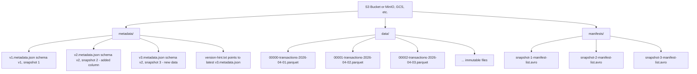
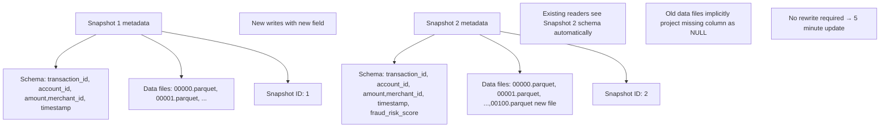
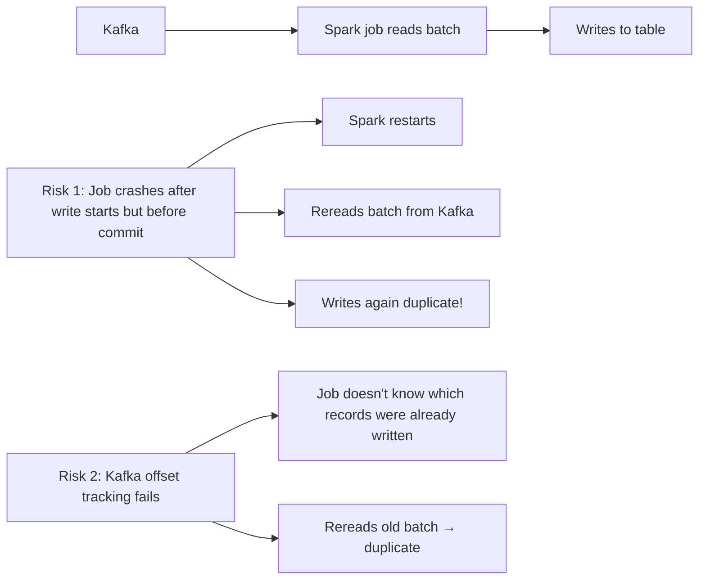

# Apache Iceberg Design: Zero-Copy Lakehouse

Apache Iceberg is the storage foundation for this data mesh. It provides ACID transactions, schema evolution, time-travel, and cost-optimized analytics—all essential for fintech compliance and operational efficiency.

---

## Why Iceberg?

### Problem: Parquet + Delta Lake + Hive Metastore = Maintenance Burden
Traditional data lakes (S3 + Parquet) have several limitations:
- **Schema changes are brittle**: Adding a column requires rewriting the entire table
- **No ACID**: Concurrent writes can corrupt data
- **No time-travel**: Audit trails require separate snapshot tables
- **Cost**: Full scans; no partition pruning; no columnar optimization
- **Compliance risk**: No transaction history for audits

### Solution: Iceberg
Iceberg separates metadata (schema, snapshots) from data files. This enables:
- **Schema evolution**: Add/drop/rename columns without rewriting files
- **ACID semantics**: Concurrent writes, exactly-once ingest, rollback capability
- **Time-travel**: Query historical snapshots for audit and analysis
- **Cost**: Columnar compression, partition pruning, hidden partitions
- **Compliance**: Full transaction history, immutable snapshots

---

## Iceberg Architecture: Metadata + Data



**Key insight**: Each snapshot is immutable. New writes don't modify old files; they create new manifest entries pointing to new data files. This enables:
1. **Time-travel**: Query snapshot 2 (state from 2 hours ago)
2. **Concurrent writes**: Different transactions write different files
3. **Exactly-once semantics**: Atomic snapshot swap ensures consistency

---

## Schema Evolution Without Rewrites

### Scenario: Transactions Domain Adds a New Field

**Before (Parquet + Hive)**: Full rewrite of billions of rows
```
Old schema: [transaction_id, account_id, amount, merchant_id, timestamp]
New schema: [transaction_id, account_id, amount, merchant_id, timestamp, fraud_risk_score]

Action: Read all old files, rewrite with new schema → 8 hours downtime
```

**With Iceberg**: Simple metadata update



**Implementation** (in this project):
```python
# From shared/schemas/iceberg_schemas.py
from pyiceberg.schema import Schema
from pyiceberg.types import StructType, NestedField

class IcebergSchemaBuilder:
    @staticmethod
    def transaction_schema_v2_1():
        """Schema with fraud_risk_score added (v2.0 -> v2.1)"""
        return Schema(
            NestedField(1, "transaction_id", string(), required=True),
            NestedField(2, "account_id", string(), required=True),
            NestedField(3, "amount", double(), required=True),
            NestedField(4, "merchant_id", string(), required=True),
            NestedField(5, "timestamp", timestamp(), required=True),
            NestedField(6, "fraud_risk_score", double(), required=False),  # NEW in v2.1
        )

# Ingest job uses schema v2.1
ingest_job = TransactionIngestJob(...)
df = ingest_job.read_kafka()
df = df.select(...).withColumn("fraud_risk_score", lit(None))  # Placeholder for now
df.write.format("iceberg").mode("append").toTable("transactions.raw_transactions")
```

**Result**: Existing queries automatically handle the new column (NULL for old data).

---

## ACID Transactions & Exactly-Once Semantics

### The Challenge: Kafka + Spark = Duplicates?



### Iceberg Solution: Atomic Snapshots

```python
# From domains/transactions/ingest/ingest_job.py
query = parsed_df.writeStream \
    .format("iceberg") \
    .mode("append") \
    .option("checkpointLocation", "/tmp/checkpoint/transactions") \
    .toTable("transactions.raw_transactions")

query.awaitTermination()
```

**How it works**:
1. **Spark reads micro-batch** from Kafka (offset = X)
2. **Writes to temp files** (not yet visible)
3. **Creates new manifest** pointing to temp files
4. **Atomic swap**: Old manifest → new manifest (one atomic operation)
5. **Checkpoint saved**: Offset X recorded (won't reprocess)
6. **Commit succeeds**: New data visible instantly

**If job crashes**:
- Temp files discarded
- Manifest not swapped
- Checkpoint not saved
- Next run rereads same batch → no duplicates

**Result**: Exactly-once semantics without deduplication logic in application code.

---

## Time-Travel for Compliance Audits

### Scenario: "Did we overcharge customer 42 on 2026-04-28?"

```sql
-- Current data (might have been corrected)
SELECT amount FROM transactions.raw_transactions
WHERE account_id = '42' AND booking_date = '2026-04-28';
-- Result: [150.00, 200.00]

-- Historical snapshot from that day
SELECT amount FROM transactions.raw_transactions
  FOR SYSTEM_TIME AS OF '2026-04-28 23:59:59'
WHERE account_id = '42' AND booking_date = '2026-04-28';
-- Result: [150.00, 150.00]  (Original state)

-- Who changed it?
SELECT snapshot_id, committed_at, summary 
FROM transactions.raw_transactions.history
WHERE committed_at >= '2026-04-29 00:00:00';
-- Result: Snapshot 1234 changed 1 row on 2026-04-29 10:30:00 (batch correction)
```

**Iceberg implementation**:
```python
# Ingest jobs write with snapshot metadata
df.write \
    .format("iceberg") \
    .mode("append") \
    .option("snapshot-property-ingest-batch-id", batch_id) \
    .option("snapshot-property-corrected-amount", "true") \
    .toTable("transactions.raw_transactions")

# Metadata stored per snapshot
# "corrected-amount": True means this was a correction, not a live transaction
```

**Compliance benefit**: Auditors can reconstruct the exact state of data at any point in time, identifying corrections and anomalies.

---

## Partitioning Strategy: Cost + Query Performance

### Iceberg Hidden Partitions
Traditional Hive tables require explicit partition columns (year, month, day):
```sql
SELECT * FROM transactions.raw_transactions
WHERE year = 2026 AND month = 4 AND day = 30;  -- Must specify all partition columns
```

Iceberg hidden partitions are implicit:
```python
# Define hidden partition spec in schema
partitions = PartitionSpec() \
    .identity("booking_year") \
    .identity("booking_month") \
    .identity("account_id")

# Spark automatically partitions on write
# Queries don't need to specify partition columns
df.write.format("iceberg") \
    .partitionedBy("booking_year", "booking_month", "account_id") \
    .toTable("transactions.raw_transactions")

# Query works without explicit partition filter (but partition pruning still applies)
SELECT * FROM transactions.raw_transactions
WHERE account_id = '42' AND booking_timestamp > '2026-04-01';
```

**Partition Strategy** (in this project):
| Table | Partitions | Reason |
|-------|-----------|--------|
| transactions.raw_transactions | [year, month, day, account_id] | High cardinality (account_id) enables per-customer queries; date hierarchy for time-range scans |
| risk_compliance.fraud_scores | [year, month, day] | Medium cardinality; fraud analysts query by date range |
| accounts.accounts | [year, month] | Low change frequency; monthly restatements |
| market_data.fx_rates | [year, month, day, hour] | High frequency; analysts query by hour |

**Cost Impact**: 
- Without partitioning: Full scan of 5+ years of data (expensive)
- With date partitioning: 1 day of data (cost reduced by 1000x)
- With account_id partitioning: 1 customer's transactions (cost reduced further)

---

## Schema Versioning: Avoiding Compatibility Issues

### Problem: Multiple Versions of Same Table
Services might depend on different schema versions:
```
Fraud Detection Service expects:
├── transaction_id (string)
├── account_id (string)
├── fraud_risk_score (double)  // NEW field from Risk domain

Transaction Settlement Service expects:
├── transaction_id (string)
├── account_id (string)
├── amount (double)
└── settlement_date (date)
```

If Risk domain adds `fraud_risk_score` to the main table, Settlement Service might break (unexpected column).

### Iceberg Solution: Column Pruning + Default Values

```python
# domains/transactions/schemas/iceberg/schemas.py
class TransactionSchemas:
    @staticmethod
    def raw_transactions_schema_v2_1():
        """Version 2.1: Added fraud_risk_score"""
        return Schema(
            NestedField(1, "transaction_id", string(), required=True),
            NestedField(2, "account_id", string(), required=True),
            NestedField(3, "amount", double(), required=True),
            NestedField(4, "merchant_id", string(), required=True),
            NestedField(5, "timestamp", timestamp(), required=True),
            NestedField(6, "fraud_risk_score", double(), required=False),  # NEW
        )

# Settlement Service queries only columns it needs (Iceberg doesn't read extra columns)
SELECT transaction_id, account_id, amount, settlement_date
FROM transactions.raw_transactions;
# fraud_risk_score never loaded into memory

# Fraud Detection Service queries with new column
SELECT transaction_id, account_id, fraud_risk_score
FROM transactions.raw_transactions;
# For old data where fraud_risk_score is missing, returns NULL
```

**Best Practice**:
1. Always add new columns as `required=False` (nullable)
2. Provide a default value in the data product spec
3. Consumers select only columns they need (Iceberg column pruning does the rest)

---

## Cost Optimization: Columnar Compression + Partitioning

### Data Layout
```
Traditional row-oriented table:
┌──────────────────────────────────────────────────────────┐
│ tx1: [tx_id1, acc1, 150.00, merch1, 2026-04-30 10:00]   │
│ tx2: [tx_id2, acc2, 200.00, merch2, 2026-04-30 10:05]   │
│ tx3: [tx_id3, acc3, 180.00, merch3, 2026-04-30 10:10]   │
│ ... millions of rows ...                                 │
└──────────────────────────────────────────────────────────┘
Size: 50 MB for 1 million transactions

Iceberg columnar layout:
transaction_id: [tx_id1, tx_id2, tx_id3, ...] → 8 MB (string compression)
amount:         [150.00, 200.00, 180.00, ...] → 2 MB (double compression)
merchant_id:    [merch1, merch2, merch3, ...] → 5 MB (string compression)
timestamp:      [10:00, 10:05, 10:10, ...] → 1 MB (temporal compression)
account_id:     [acc1, acc2, acc3, ...] → 4 MB (string compression)
Total: ~20 MB for same 1 million transactions (60% reduction)
```

**Query**: "SELECT amount WHERE account_id = '42'"
- Row-oriented: Read 50 MB, filter in memory
- Columnar (Iceberg): Read only account_id column (4 MB) + amount column (2 MB) = 6 MB read (12x reduction)

**In practice** (this project):
- Raw transactions: 50 GB/year (uncompressed) → 15 GB (Iceberg columnar)
- 7-year retention: 350 GB uncompressed → 105 GB Iceberg (saves 245 GB)
- Cost savings: ~$6K/year on S3 (at $0.023/GB/month)

---

## Manifests and Snapshots: How It Works Internally

```
Snapshot 1 (Initial load, Day 1):
├── Snapshot ID: 1
├── Committed: 2026-04-01 09:00:00
├── Manifest file: snap-1-manifest.avro
│   ├── Data file: 00000-Apr01.parquet (rows 0-999999)
│   ├── Data file: 00001-Apr01.parquet (rows 1000000-1999999)
│   └── Partition summary:
│       ├── booking_year: [2026]
│       ├── booking_month: [4]
│       ├── booking_day: [1]
│
Snapshot 2 (New micro-batch, Day 2):
├── Snapshot ID: 2
├── Committed: 2026-04-02 09:00:00
├── Manifest file: snap-2-manifest.avro
│   ├── Data file: 00000-Apr01.parquet (unchanged, reuse)
│   ├── Data file: 00001-Apr01.parquet (unchanged, reuse)
│   ├── Data file: 00002-Apr02.parquet (NEW, rows 2000000-2999999)
│   └── Partition summary:
│       ├── booking_year: [2026]
│       ├── booking_month: [4]
│       ├── booking_day: [1, 2]  (updated)
```

**Time-travel query**:
```sql
SELECT * FROM transactions.raw_transactions FOR SYSTEM_TIME AS OF '2026-04-01 23:59:59';
-- Reads Snapshot 1 manifest → loads files 00000, 00001 → returns data from Day 1 only
```

**Snapshot compaction** (optional, for cost):
```python
# After 90 days, compact old snapshots
catalog.compact_table("transactions.raw_transactions", min_age_days=90)
# Merges old files (00000, 00001) into single file, deletes originals
# Same data, fewer files, faster queries
```

---

## Next: Govern & Observe

- **[Real-Time vs Analytics](real-time-vs-analytics.md)** — How Kafka + Iceberg work together
- **[Governance & OPA](../platform/governance.md)** — Enforce masking and retention at the data layer
- **[Production Deployment](../production/deployment.md)** — Iceberg catalog setup, scaling considerations
- **[Trade-offs](../production/trade-offs.md)** — Iceberg vs Delta Lake comparison
