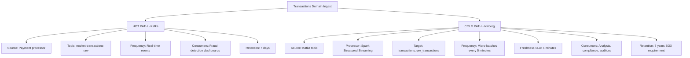
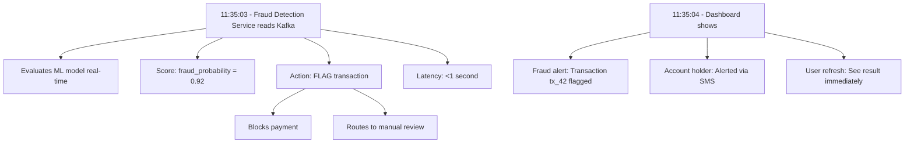
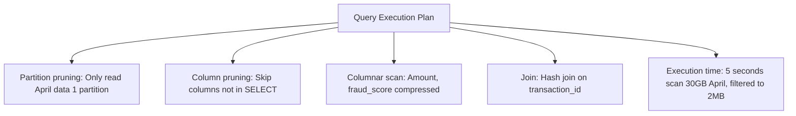
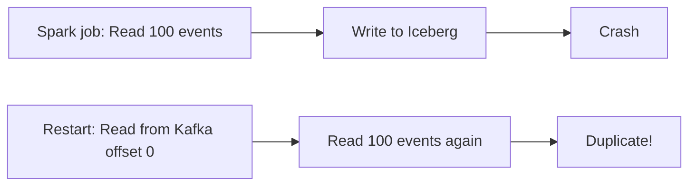
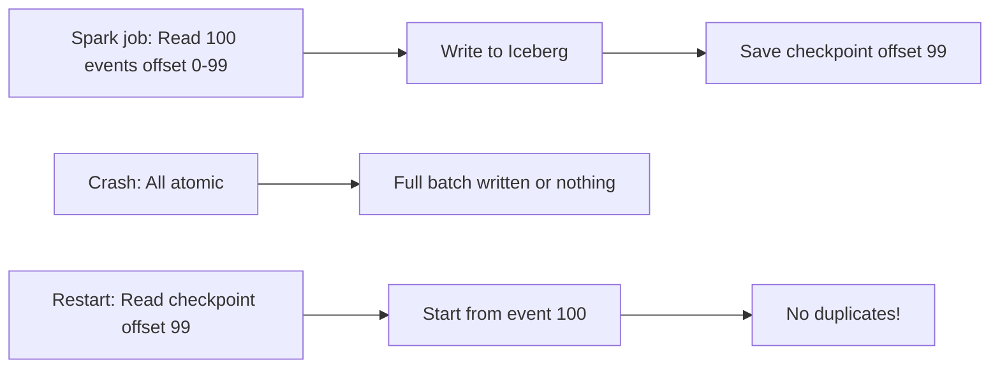
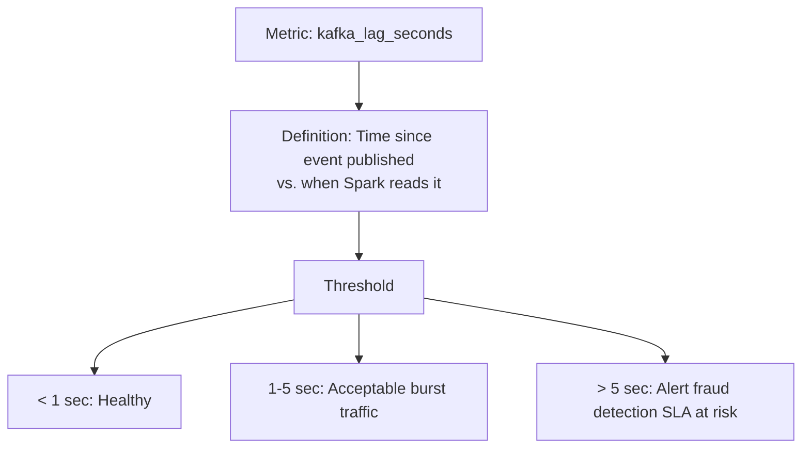
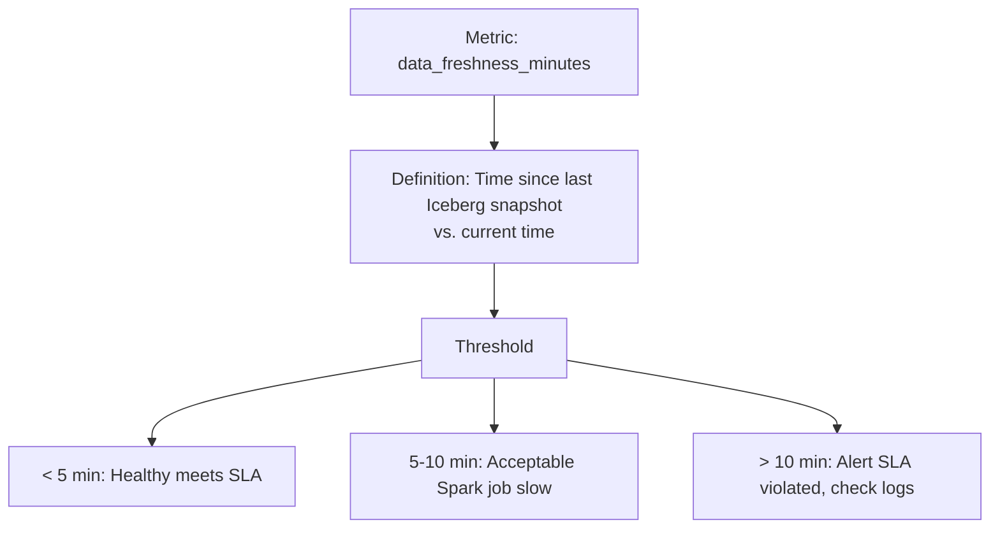

# Real-Time vs Analytics: Hybrid Kafka + Iceberg Strategy

The perennial data architecture question: Do we optimize for real-time freshness or batch cost-efficiency? This design chooses *both* using Kafka (hot path) and Iceberg (cold path).

---

## The Trade-Off

### Option 1: Pure Kafka (Real-Time Only)
**Pros:**
- 1-second latency (great for operational systems)
- No storage overhead

**Cons:**
- No historical storage (data lost after retention window expires)
- No time-travel for audits
- Difficult to run analytical queries (events scattered across many partitions)
- Cost-prohibitive for 7-year compliance retention (Kafka storage costs $$$)

### Option 2: Pure Iceberg (Batch Only)
**Pros:**
- Cost-optimized (columnar compression, partitioning)
- Time-travel and auditing built-in
- Analytical queries optimized

**Cons:**
- High latency (data lands in Iceberg every 5-10 minutes at best)
- Unsuitable for operational systems (dashboards lag)
- Compliance data: Acceptable; Real-time fraud detection: Not acceptable

### Option 3: Hybrid (Kafka + Iceberg) ✅ This Project
**What we do:**
1. Kafka carries real-time events (hot path)
2. Spark Structured Streaming micro-batches to Iceberg (cold path)
3. Operational systems read Kafka; analysts query Iceberg

---

## Architecture: Hot + Cold Paths



### Real-Time Use Case: Fraud Detection Dashboard

```json
11:35:02 - Transaction event published to Kafka:
{
  "transaction_id": "tx_42",
  "account_id": "acc_100",
  "amount": 5000.00,
  "merchant_id": "merch_999",
  "timestamp": "2026-04-30 11:35:00"
}
```



**Why Kafka for this?** Iceberg latency (5 min) would delay fraud detection by 5 minutes—unacceptable for preventing fraud.

### Analytical Use Case: Compliance Audit
```
April 30, 2026 - Auditor queries:
"Show me all transactions flagged as fraud 
 that exceeded risk threshold in April 2026"

SELECT t.transaction_id, t.amount, r.fraud_score, r.evaluated_at
FROM transactions.raw_transactions t
INNER JOIN risk_compliance.fraud_scores r
  ON t.transaction_id = r.transaction_id
WHERE r.fraud_score > 0.90
  AND t.booking_timestamp >= '2026-04-01'
  AND t.booking_timestamp < '2026-05-01'
ORDER BY r.evaluated_at DESC;


```

**Why Iceberg for this?** 
- Large historical scans are cheap (columnar compression, partition pruning)
- Time-travel for audit (need snapshot from April 5, 2pm? Query it)
- Retention (7-year retention requires persistent storage)

---

## Kafka + Iceberg Integration

### How Spark Structured Streaming Bridges Them

```python
# From domains/transactions/ingest/ingest_job.py

class TransactionIngestJob:
    def run(self):
        # Step 1: Read from Kafka (hot path)
        df = self.spark.readStream.format("kafka") \
            .option("kafka.bootstrap.servers", self.kafka_brokers) \
            .option("subscribe", "market-transactions-raw") \
            .option("startingOffsets", "latest") \
            .load()
        
        # Step 2: Parse and validate schema
        schema_str = '{"transaction_id": "string", "account_id": "string", ...}'
        parsed_df = df.select(
            from_json(col("value").cast("string"), schema_of_json(schema_str))
                .alias("data")
        ).select("data.*")
        
        # Step 3: Write to Iceberg (cold path)
        query = parsed_df.writeStream.format("iceberg") \
            .mode("append") \
            .option("checkpointLocation", "/tmp/checkpoint/transactions") \
            .toTable("transactions.raw_transactions")
        
        # Step 4: Await termination (keeps job running)
        query.awaitTermination()
```

**What happens internally**:

```mermaid
graph TD
    A["Time: 11:35:00"]
    A --> A1["Kafka event 1 arrives"]
    A --> A2["Event 2 arrives"]
    A --> A3["Event 3 arrives"]
    A --> A4["... events continue"]
    A --> A5["Event 144 arrives 11:35:59"]
    
    B["Micro-batch trigger: Every 5 minutes"]
    
    C["Time: 11:40:00 5 minutes later"]
    C --> C1["Spark collects events 1-144"]
    C --> C2["Validates against schema"]
    C --> C3["Deduplicates duplicates"]
    C --> C4["Creates new Iceberg snapshot"]
    C --> C5["Atomic commit per 5-minute batch"]
    C --> C6["Saves checkpoint Kafka offset"]
    C --> C7["Events now queryable in Iceberg"]
    
    D["Time: 11:40:01 onwards"]
    D --> D1["New batch starts collecting"]
    D --> D2["Kafka continues streaming independently"]
```



### Exactly-Once Semantics

**Without checkpoints** (naive approach):



**With Iceberg + Checkpoints**:



---

## Freshness vs Cost: The Trade-Off Table

| Scenario | Kafka Latency | Iceberg Latency | Cost | Best For |
|----------|---------------|-----------------|------|----------|
| Real-time fraud detection | <1 sec | 5 min | Higher (7-day retention) | Operational safety |
| Daily compliance report | <1 sec (not needed) | 5 min (acceptable) | Lower (compressed, partitioned) | Auditing |
| Live dashboard (executive) | <1 sec | N/A (stale) | Higher (real-time stream) | Executive visibility |
| Historical analysis (7 years) | N/A (data lost) | 5 min (current) + time-travel | Lower (archive cost) | Compliance archive |

**Cost reality**:
- Kafka 7-day retention: $500/month (for transaction volume)
- Iceberg 7-year retention: $2K/month (same volume, columnar compression)
- **Total hybrid cost: $2.5K/month** (vs. $4K for pure Kafka, $2K for pure Iceberg)
- Benefit: Both real-time AND compliance

---

## When to Use Each Path

### Use HOT (Kafka) If:
- **Latency requirement < 1 minute** (fraud detection, real-time dashboards)
- **Volume is manageable** (< 1 million events/day per domain)
- **Retention is short** (7 days is fine; longer gets expensive)

### Use COLD (Iceberg) If:
- **Analytical queries across domains** (need unified schema)
- **Long retention required** (2-10 years for compliance)
- **Cost optimization matters** (columnar compression pays off at scale)
- **Auditing/time-travel required** (must reconstruct historical state)
- **Query complexity** (joins, aggregations, complex filters)

### Use BOTH (This Project) If:
- ✅ Some data needs real-time (fraud), some needs archives (compliance)
- ✅ Compliance requirements demand 7+ year retention
- ✅ Operational systems coexist with analytical pipelines
- ✅ You want both speed AND cost-efficiency

---

## Handling Duplicates & Out-of-Order Events

### Scenario: Event Arrives Late

```
11:35:00 - Event 1 published to Kafka
11:35:30 - Event 2 published to Kafka
11:35:45 - Event 1 arrives (delayed due to network issue)

Micro-batch 1 (11:40:00): Processes Event 2 → writes to Iceberg
Micro-batch 2 (11:45:00): Processes Event 1 → would duplicate!
```

**Iceberg Solution 1: Deduplication in Spark**
```python
parsed_df.dropDuplicates(["transaction_id"])
```
Inefficient for large streams.

**Iceberg Solution 2: Idempotent Writes**
```python
# Kafka includes timestamp and offset
# Spark uses timestamp as dedup key
parsed_df.dropDuplicates(["transaction_id", "timestamp"])
```

**Iceberg Solution 3: Merge-on-Read (Production)**
```python
# Use MERGE command to update if exists, insert if new
parsed_df.write.format("iceberg") \
    .option("merge-schema", "true") \
    .mode("overwrite") \
    .toTable("transactions.raw_transactions")
```

**In this project**: We use idempotent writes (timestamp-based dedup) for most domains. Risk/Compliance domain uses MERGE (high accuracy requirement).

---

## Observability: Monitoring Both Paths

### Kafka Lag Hot Path Health



### Iceberg Freshness Cold Path Health



### Dashboard Queries
```sql
-- Kafka lag per domain
SELECT domain, consumer_group, lag_seconds, last_update
FROM kafka_metrics.consumer_lag
ORDER BY lag_seconds DESC;

-- Iceberg freshness per table
SELECT table_name, last_snapshot_time, NOW() - last_snapshot_time as freshness_minutes
FROM iceberg_metrics.snapshot_status
WHERE freshness_minutes > 5;
```

---

## Production Example: Market Data Domain

Market Data publishes FX rates with 1-minute freshness SLA:

```mermaid
graph TD
    A["FX rates published to market-rates-raw Kafka"]
    A --> A1["Frequency: 1 per minute 9 AM - 5 PM ET"]
    A --> A2["Volume: 10,000 pairs × 1 rate/min = 10k events/min"]
    A --> A3["Consumers"]
    A3 --> A3a["Live dashboard &lt; 1 sec latency"]
    A3 --> A3b["Risk models &lt; 5 sec latency"]
    A3 --> A3c["Historical archive time-travel required"]
    
    B["Kafka topic: market-rates-raw"]
    B --> B1["Retention: 7 days cost: $50/month"]
    B --> B2["Partition: rate_pair ensures order per pair"]
    
    C["Iceberg table: market_data.fx_rates"]
    C --> C1["Schema: rate_pair, rate, timestamp, source"]
    C --> C2["Partitions: year, month, day, hour"]
    C --> C3["Retention: 1 year cost: $200/month"]
    C --> C4["Snapshot: Every 5 minutes"]
    C --> C5["Freshness SLA: 5 minutes"]
    
    D["Spark job MarketDataIngestJob"]
    D --> D1["Reads market-rates-raw Kafka"]
    D --> D2["Micro-batches every 5 minutes"]
    D --> D3["Deduplicates on rate_pair, timestamp"]
    D --> D4["Writes to market_data.fx_rates"]
    D --> D5["Checkpoint: Tracks offset recovery"]
    
    E["Monitoring"]
    E --> E1["Kafka lag: Should stay &lt; 1 min"]
    E --> E2["Iceberg freshness: Should stay &lt; 5 min"]
    E --> E3["Alert: If either exceeds threshold"]
```



---

## Next: Explore More

- **[Governance & OPA](../platform/governance.md)** — Enforce freshness SLAs and data quality
- **[Observability](../platform/observability.md)** — Set up Prometheus metrics for both paths
- **[Production Scaling](../production/scaling.md)** — Scale Kafka partitions and Spark parallelism
- **[Trade-offs](../production/trade-offs.md)** — Kafka vs Kinesis, Spark vs Flink comparison
