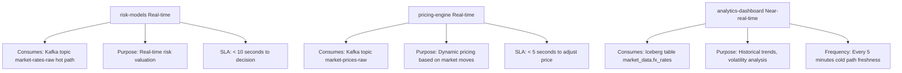
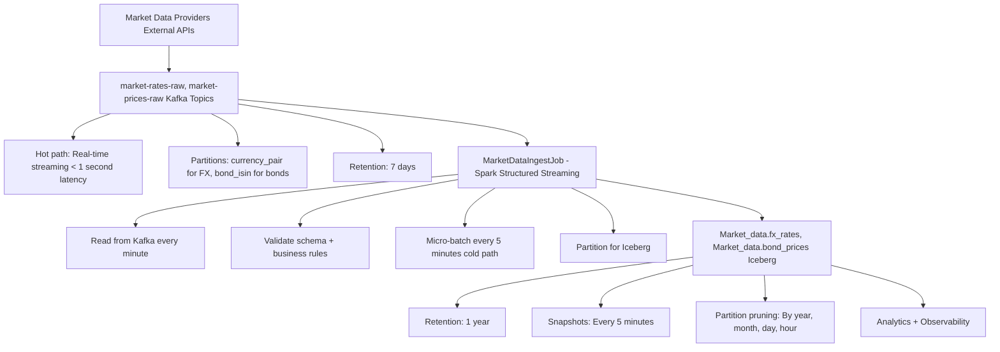
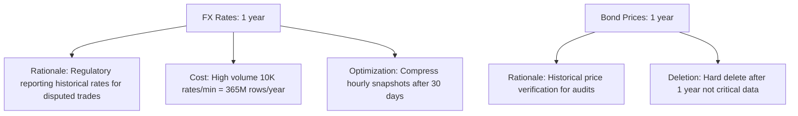
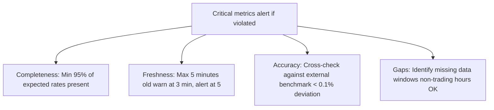

# Market Data Domain

High-frequency external market data feeds (FX rates, bond prices, equity indices) for risk calculations, pricing, and regulatory reporting.

---

## Overview

| Attribute | Value |
|-----------|-------|
| **Owner** | Market Data Team |
| **Contact** | market-data@chakra.fintech |
| **Data Products** | market-feeds |
| **Kafka Topics** | market-rates-raw, market-prices-raw |
| **Iceberg Namespace** | market_data |
| **Freshness SLA** | 1 minute |
| **Availability SLA** | 99.95% |
| **Retention** | 1 year |
| **Velocity** | Very high (10K+ events/min) |
| **Status** | Production |

---

## Data Products

### market-feeds

Real-time market data feeds for FX rates, bond prices, and equity indices.

**FX Rates Schema** (Avro v1.0):
```json
{
  "type": "record",
  "name": "FXRate",
  "fields": [
    {"name": "currency_pair", "type": "string"},
    {"name": "rate", "type": "double"},
    {"name": "timestamp", "type": "long"},
    {"name": "source", "type": "string"}
  ]
}
```

**Bond Prices Schema** (Avro v1.0):
```json
{
  "type": "record",
  "name": "BondPrice",
  "fields": [
    {"name": "bond_isin", "type": "string"},
    {"name": "price", "type": "double"},
    {"name": "yield", "type": "double"},
    {"name": "timestamp", "type": "long"}
  ]
}
```

**Iceberg Tables**:
- `market_data.fx_rates`: Partitions [year, month, day, hour]
- `market_data.bond_prices`: Partitions [year, month, day]

**SLAs**:
```yaml
freshness:
  value: 1
  unit: minutes
  definition: "Market data updates within 1 minute of source publication"

availability:
  value: 99.95
  unit: percent

completeness:
  value: 99.5
  unit: percent
  note: "Market gaps during non-trading hours are acceptable"
```

**Quality Rules**:
```yaml
- name: positive_rate
  rule: "rate > 0"
  impact: critical

- name: positive_yield
  rule: "yield > -1.0 AND yield < 100.0"
  impact: high
  comment: "Yields in range [-1%, +100%]"

- name: recent_timestamp
  rule: "ABS(UNIX_TIMESTAMP() - timestamp) < 300"
  impact: high
  comment: "Data not older than 5 minutes"

- name: valid_currency_pair
  rule: "currency_pair LIKE '[A-Z]{3}[A-Z]{3}'"
  impact: medium
```

**Access Policy**:
```yaml
default: deny

approval_required: false
approval_sla_hours: null

columns:
  - name: rate
    classification: public
    masked_for_roles: []

  - name: price
    classification: public
    masked_for_roles: []

  - name: yield
    classification: public
    masked_for_roles: []

  - name: timestamp
    classification: public
    masked_for_roles: []
```

**Downstream Consumers**:



---

## Ingest Pipeline

### Architecture



### Implementation

```python
# From domains/market_data/ingest/ingest_job.py

class MarketDataIngestJob:
    DOMAIN = "market_data"
    FX_TOPIC = "market-rates-raw"
    PRICES_TOPIC = "market-prices-raw"
    FX_TABLE = f"{DOMAIN}.fx_rates"
    PRICES_TABLE = f"{DOMAIN}.bond_prices"

    def run_fx_rates(self):
        """Ingest FX rates with 1-minute freshness SLA"""
        df = self.spark.readStream.format("kafka") \
            .option("kafka.bootstrap.servers", self.kafka_brokers) \
            .option("subscribe", self.FX_TOPIC) \
            .option("startingOffsets", "latest") \
            .load()

        schema_str = '''{
            "currency_pair": "string",
            "rate": "double",
            "timestamp": "long",
            "source": "string"
        }'''
        
        parsed_df = df.select(
            from_json(col("value").cast("string"), schema_of_json(schema_str))
                .alias("data")
        ).select("data.*")

        # Filter recent data (drop stale updates)
        parsed_df = parsed_df.filter(
            col("timestamp") > (unix_timestamp() - 300)  # Max 5 min old
        )

        query = parsed_df.writeStream \
            .format("iceberg") \
            .mode("append") \
            .option("checkpointLocation", f"/tmp/checkpoint/{self.DOMAIN}/fx") \
            .toTable(self.FX_TABLE)
        
        query.awaitTermination()
```

---

## Governance & Compliance

### Retention Policy



### Data Quality Monitoring



---

## Queries

### Volatility Analysis

```sql
-- 30-day volatility for each currency pair
SELECT 
  currency_pair,
  STDDEV(rate) as volatility,
  MIN(rate) as min_rate,
  MAX(rate) as max_rate,
  AVG(rate) as avg_rate,
  (MAX(rate) - MIN(rate)) / AVG(rate) as pct_range
FROM market_data.fx_rates
WHERE timestamp > UNIX_TIMESTAMP(CURRENT_DATE - INTERVAL 30 days)
  AND timestamp < UNIX_TIMESTAMP(CURRENT_DATE)
GROUP BY currency_pair
ORDER BY volatility DESC;
```

### Market Move Detection

```sql
-- Detect large market moves (> 2% in 1 hour)
WITH hourly_rates AS (
  SELECT 
    currency_pair,
    HOUR(FROM_UNIXTIME(timestamp)) as hour_of_day,
    FIRST(rate) as open_rate,
    LAST(rate) as close_rate,
    MAX(rate) as high_rate,
    MIN(rate) as low_rate
  FROM market_data.fx_rates
  WHERE timestamp > UNIX_TIMESTAMP(CURRENT_DATE - INTERVAL 1 day)
  GROUP BY currency_pair, HOUR(FROM_UNIXTIME(timestamp))
)
SELECT 
  currency_pair,
  hour_of_day,
  open_rate,
  close_rate,
  ROUND(100.0 * ABS(close_rate - open_rate) / open_rate, 2) as pct_move
FROM hourly_rates
WHERE ABS(close_rate - open_rate) / open_rate > 0.02
ORDER BY pct_move DESC;
```

---

## Scaling for High-Frequency Data

### Kafka Configuration

```
Topic: market-rates-raw
├── Partitions: 10 (one per currency group)
├── Replication: 3
├── Retention: 7 days
├── Throughput: 10,000 messages/minute (FX rates)
└── Partition key: currency_pair (ensures ordering per pair)

Topic: market-prices-raw
├── Partitions: 5
├── Retention: 7 days
├── Throughput: 5,000 messages/minute (bond prices)
└── Partition key: bond_isin
```

### Spark Job Scaling

```
MarketDataIngestJob (FX Rates):
├── Executors: 5 (matches Kafka partitions)
├── Cores per executor: 4
├── Memory per executor: 4GB
├── Typical batch: 50K FX updates per 5-min batch
└── Throughput: 10K msg/min → 167 msg/sec

MarketDataIngestJob (Bond Prices):
├── Executors: 2 (matches demand)
├── Cores: 2
├── Memory: 2GB
└── Throughput: 5K msg/min → 83 msg/sec
```

### Iceberg Optimization

```
Partition strategy (hourly updates for FX):
├── [year, month, day, hour] = 8766 partitions/year
├── Typical partition size: 500MB (1 hour of FX data)
├── Query "Last 7 days of EUR/USD": Scans 7*24 = 168 partitions (84GB)
└── Cost: $1.93/query vs. $23.10 without partitioning

Compaction schedule:
├── Daily: Merge files from previous day (< 5 files/partition)
├── Monthly: Consolidate month-old snapshots
├── Yearly: Archive and compress data older than 6 months
```

---

## Observability

### SLA Dashboard

```yaml
metric: data_freshness_minutes{domain="market_data", table="fx_rates"}
definition: "Time since last Iceberg snapshot"
target: < 1 minute
warning: > 2 minutes
critical: > 5 minutes

metric: kafka_lag_seconds{domain="market_data", topic="market-rates-raw"}
definition: "Time since Kafka event published vs. Spark reads"
target: < 10 seconds
warning: > 30 seconds
critical: > 60 seconds

metric: data_completeness_pct{domain="market_data", table="fx_rates"}
definition: "Percentage of expected rates present"
target: > 99.5%
warning: > 95%
critical: < 90%
```

---

## Production Considerations

### High-Frequency Gotchas

1. **Late-arriving data**: Markets may backfill rates (e.g., correction at 9:05 AM for 9:02 AM)
   - Solution: Allow 10-minute grace period for late data
   - Implementation: Only write to Iceberg if timestamp < current_time - 10 min

2. **Duplicate rates**: Exchange may resend same rate multiple times
   - Solution: Deduplicate on (currency_pair, timestamp)
   - Implementation: `dropDuplicates(["currency_pair", "timestamp"])`

3. **Stale data**: If market source goes down, old rates remain
   - Solution: Quality check "timestamp < 5 minutes old"
   - Implementation: Filter in Spark job

4. **Partition explosion**: If partitioning by [year, month, day, hour, minute], 8766 * 60 = 525K partitions/year
   - Solution: Use [year, month, day, hour] (8766 partitions/year)
   - Tradeoff: Slightly larger partitions, but manageable

---

## Next

- **[Transactions Domain](transactions.md)** — Compare event velocity with market data
- **[Observability](../platform/observability.md)** — Set up freshness alerts
- **[Production Scaling](../production/scaling.md)** — Kafka and Spark tuning for high volume
