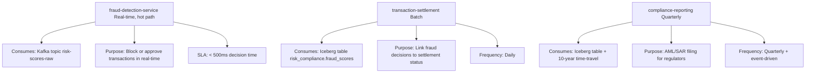

# Risk & Compliance Domain

Fraud detection, KYC verdicts, sanctions screening, and AML compliance. Highest regulatory requirements and longest retention (10 years).

---

## Overview

| Attribute | Value |
|-----------|-------|
| **Owner** | Risk & Compliance Team |
| **Contact** | risk-compliance@chakra.fintech |
| **Data Products** | risk-scores, kyc-master, sanctions-list |
| **Kafka Topics** | risk-scores-raw, kyc-verdicts-raw |
| **Iceberg Namespace** | risk_compliance |
| **Freshness SLA** | 10 minutes |
| **Availability SLA** | 99.99% |
| **Retention** | 10 years (AML/SOX) |
| **Approval Required** | YES (sensitive data) |
| **Approval SLA** | 2 hours |
| **Status** | Production |

---

## Data Products

### fraud-scores

Real-time fraud risk scoring for transactions.

**Schema** (Avro v1.0):
```json
{
  "type": "record",
  "name": "FraudScore",
  "fields": [
    {"name": "transaction_id", "type": "string"},
    {"name": "account_id", "type": "string"},
    {"name": "fraud_score", "type": "double"},
    {"name": "risk_level", "type": {"type": "enum", "symbols": ["LOW", "MEDIUM", "HIGH", "CRITICAL"]}},
    {"name": "reasons", "type": {"type": "array", "items": "string"}},
    {"name": "evaluated_at", "type": "long"}
  ]
}
```

**Quality Rules**:
```yaml
- name: valid_fraud_score
  rule: "fraud_score >= 0.0 AND fraud_score <= 1.0"
  impact: critical

- name: risk_level_matches_score
  rule: |
    (risk_level = 'LOW' AND fraud_score < 0.3) OR
    (risk_level = 'MEDIUM' AND fraud_score >= 0.3 AND fraud_score < 0.7) OR
    (risk_level = 'HIGH' AND fraud_score >= 0.7 AND fraud_score < 0.9) OR
    (risk_level = 'CRITICAL' AND fraud_score >= 0.9)
  impact: critical

- name: reasons_not_empty_if_high_risk
  rule: "fraud_score < 0.7 OR array_length(reasons) > 0"
  impact: high
```

**Access Policy** (Sensitive Data):
```yaml
default: deny

approval_required: true
approval_sla_hours: 2

columns:
  - name: fraud_score
    classification: restricted
    masked_for_roles: [everyone_except_risk_analysts]
    mask_strategy: full_hash

  - name: reasons
    classification: restricted
    masked_for_roles: [everyone_except_risk_analysts]
    mask_strategy: full_hash

  - name: risk_level
    classification: sensitive
    masked_for_roles: [external_analyst]
    mask_strategy: show_high_level_only  # CRITICAL vs non-CRITICAL

  - name: transaction_id
    classification: pii
    masked_for_roles: [contractor]
    mask_strategy: partial_hash
```

**Downstream Consumers**:



### kyc-verdicts

Know Your Customer (KYC) verification status and results.

**Schema** (Avro v1.0):
```json
{
  "type": "record",
  "name": "KYCVerdict",
  "fields": [
    {"name": "account_id", "type": "string"},
    {"name": "customer_id", "type": "string"},
    {"name": "kyc_status", "type": {"type": "enum", "symbols": ["APPROVED", "PENDING", "REJECTED", "EXPIRED"]}},
    {"name": "kyc_type", "type": {"type": "enum", "symbols": ["INITIAL", "ENHANCED", "REFRESH"]}},
    {"name": "risk_profile", "type": {"type": "enum", "symbols": ["LOW", "MEDIUM", "HIGH"]}},
    {"name": "approved_at", "type": ["null", "long"]},
    {"name": "expires_at", "type": ["null", "long"]}
  ]
}
```

**Quality Rules**:
```yaml
- name: approved_date_before_expiry
  rule: "approved_at IS NULL OR expires_at IS NULL OR approved_at < expires_at"
  impact: critical

- name: approved_status_has_date
  rule: "kyc_status != 'APPROVED' OR approved_at IS NOT NULL"
  impact: critical
```

**Retention**: 10 years (regulatory requirement)

---

## Ingest Pipeline

### Fraud Scores Job

```python
# From domains/risk_compliance/ingest/ingest_job.py

class RiskComplianceIngestJob:
    DOMAIN = "risk_compliance"
    FRAUD_TOPIC = "risk-scores-raw"
    FRAUD_TABLE = f"{DOMAIN}.fraud_scores"
    KYC_TOPIC = "kyc-verdicts-raw"
    KYC_TABLE = f"{DOMAIN}.kyc_verdicts"

    def run_fraud_scores(self):
        df = self.spark.readStream.format("kafka") \
            .option("kafka.bootstrap.servers", self.kafka_brokers) \
            .option("subscribe", self.FRAUD_TOPIC) \
            .load()

        schema_str = '''{
            "transaction_id": "string",
            "account_id": "string",
            "fraud_score": "double",
            "risk_level": "string",
            "reasons": "array<string>",
            "evaluated_at": "long"
        }'''
        
        parsed_df = df.select(
            from_json(col("value").cast("string"), schema_of_json(schema_str))
                .alias("data")
        ).select("data.*")

        # Use MERGE for high-accuracy requirement
        # (fraud scores may need correction if evidence emerges)
        query = parsed_df.writeStream \
            .format("iceberg") \
            .mode("append") \
            .option("checkpointLocation", f"/tmp/checkpoint/{self.DOMAIN}/fraud") \
            .toTable(self.FRAUD_TABLE)
        
        query.awaitTermination()
```

### Freshness Monitoring

```yaml
fraud_scores:
  freshness_sla: 10 minutes
  target_lag: "max 10 minutes from transaction evaluation"
  
  # Alert if freshness > 15 min (50% over SLA)
  alert_threshold: 15 minutes
  
  # Metrics
  - kafka_lag_seconds (should be < 60 sec)
  - spark_batch_duration (should be < 300 sec)
  - iceberg_snapshot_age (should be < 600 sec)
```

---

## Governance & Compliance

### Retention Policy (Critical)

```
Fraud Scores: 10 years
├── Rationale: AML/Anti-Money Laundering compliance (FATF requirement)
├── SARs filed (Suspicious Activity Reports): Archive 10 years
└── Risk: Non-compliance = civil penalties ($100K-$1M+)

KYC Verdicts: 10 years
├── Rationale: KYC record-keeping (FinCEN requirement)
├── Enhanced KYC: Retain especially carefully
└── Risk: Non-compliance = license revocation

Automatic deletion: None (10-year retention is enforced)
```

### Approval Workflows

```
User: "I want to query fraud_scores"

OPA Policy Evaluation:
├── User role: analyst
├── Data classification: restricted (fraud_scores)
├── Auto-approve? NO (restricted data)
├── Route to: Risk Compliance team (owner)
├── SLA: 2 hours

Decision:
├── Owner reviews: Purpose? Risk level?
├── Accept: Grant access with masking
├── Reject: Deny request + log reason
└── Timeout (> 2 hours): Auto-grant with max masking

Logging:
├── Request ID, timestamp, user, decision
├── Audit trail: Retained 10 years
```

### Masking Strategy

```sql
-- Analyst queries fraud_scores (OPA masks automatically)
SELECT fraud_score, risk_level FROM risk_compliance.fraud_scores
WHERE evaluated_at > now() - INTERVAL 7 days;

-- Fraud analyst sees (no masking)
fraud_score | risk_level
─────────────────────────
0.95        | CRITICAL
0.72        | HIGH
0.15        | LOW

-- External analyst sees (with masking)
fraud_score | risk_level
─────────────────────────
REDACTED    | CRITICAL
REDACTED    | MEDIUM*
REDACTED    | LOW*

(*) "MEDIUM" and "LOW" shown as "NON_CRITICAL" (coarse-grained)
```

---

## Time-Travel for AML Audits

### Scenario: SAR (Suspicious Activity Report) Investigation

```sql
-- 2026-05-15: Account flagged during compliance audit
-- Need to reconstruct state on 2026-04-20

SELECT fraud_score, risk_level, reasons, evaluated_at
FROM risk_compliance.fraud_scores
  FOR SYSTEM_TIME AS OF '2026-04-20 23:59:59'
WHERE account_id = 'flagged_account_123'
ORDER BY evaluated_at;

-- Historical snapshot shows whether:
-- 1. Account was already flagged on 2026-04-20 (pre-existing)
-- 2. Flag appeared later (new activity)
-- 3. Risk level escalated over time

-- Report findings to FinCEN with audit trail
```

---

## Querying Examples

### Risk Dashboard

```sql
-- Daily risk summary
SELECT 
  CURRENT_DATE as report_date,
  COUNT(*) as total_transactions,
  SUM(CASE WHEN risk_level = 'CRITICAL' THEN 1 ELSE 0 END) as critical_count,
  SUM(CASE WHEN risk_level = 'HIGH' THEN 1 ELSE 0 END) as high_count,
  ROUND(100.0 * SUM(CASE WHEN risk_level IN ('CRITICAL', 'HIGH') THEN 1 ELSE 0 END) / COUNT(*), 2) as pct_high_risk
FROM risk_compliance.fraud_scores
WHERE evaluated_at >= UNIX_TIMESTAMP(CURRENT_DATE);
```

### KYC Expiry Check

```sql
-- Customers whose KYC expires in next 30 days
SELECT 
  account_id,
  customer_id,
  kyc_status,
  FROM_UNIXTIME(expires_at) as expiry_date,
  DATEDIFF(FROM_UNIXTIME(expires_at), CURRENT_DATE) as days_until_expiry
FROM risk_compliance.kyc_verdicts
WHERE kyc_status = 'APPROVED'
  AND expires_at < UNIX_TIMESTAMP(CURRENT_DATE + INTERVAL 30 days)
ORDER BY expires_at ASC;
```

---

## Scaling & Performance

```
Kafka topics:
├── risk-scores-raw: 5 partitions (medium volume)
├── kyc-verdicts-raw: 2 partitions (low volume)
└── Replication: 3

Spark jobs:
├── fraud_scores executor: 2 (mid-volume)
├── kyc_verdicts executor: 1 (low volume)
└── Batch window: 10 minutes

Iceberg optimization:
├── fraud_scores: Partition by [year, month, day]
├── kyc_verdicts: Partition by [year, month]
└── Compaction: Monthly (keep file count < 100)
```

---

## Compliance Checklist

- ✅ 10-year retention enforced (not optional)
- ✅ Approval workflows for sensitive data access
- ✅ Audit trails preserved (all queries logged)
- ✅ Time-travel enabled (for SAR investigations)
- ✅ Masking rules applied (PII/restricted data)
- ✅ Snapshot history preserved (no deletion)
- ✅ Monitoring & alerting on freshness SLAs

---

## Next

- **[Counterparties Domain](counterparties.md)** — Master data for merchants, banks
- **[Market Data Domain](market-data.md)** — Real-time pricing feeds
- **[Governance Guide](../platform/governance.md)** — Deeper OPA policy examples
