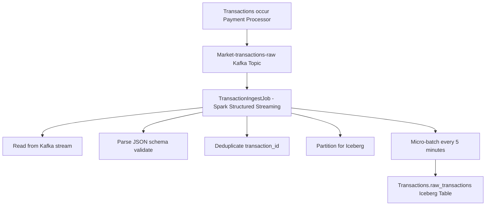

# Transactions Domain

The core fintech domain. Publishes real-time transaction events and settlement status for fraud detection, account reconciliation, and compliance reporting.

---

## Overview

| Attribute | Value |
|-----------|-------|
| **Owner** | Transactions Domain Team |
| **Contact** | transactions@chakra.fintech |
| **Data Products** | transaction-feed, settlement-status |
| **Kafka Topics** | market-transactions-raw (hot path) |
| **Iceberg Namespace** | transactions |
| **Freshness SLA** | 5 minutes |
| **Availability SLA** | 99.9% |
| **Retention** | 7 years (SOX compliance) |
| **Status** | Production |

---

## Data Products

### 1. transaction-feed

Real-time transaction events with complete payment details.

**Schema** (Avro v2.1):
```json
{
  "type": "record",
  "name": "Transaction",
  "fields": [
    {"name": "transaction_id", "type": "string"},
    {"name": "account_id", "type": "string"},
    {"name": "account_holder_name", "type": "string"},
    {"name": "amount", "type": "double"},
    {"name": "currency", "type": "string"},
    {"name": "merchant_id", "type": "string"},
    {"name": "merchant_category_code", "type": "string"},
    {"name": "booking_timestamp", "type": "long"},
    {"name": "settlement_timestamp", "type": ["null", "long"]},
    {"name": "transaction_type", "type": {"type": "enum", "symbols": ["PAYMENT", "REVERSAL", "ADJUSTMENT"]}},
    {"name": "status", "type": {"type": "enum", "symbols": ["PENDING", "CLEARED", "FAILED", "REVERSED"]}}
  ]
}
```

**Iceberg Table** (transactions.raw_transactions):
- Partitions: [year, month, day, account_id]
- Format: Parquet (columnar, compressed)
- Snapshots: Every 5 minutes (micro-batch from Kafka)

**SLAs**:
```yaml
freshness:
  value: 5
  unit: minutes
  definition: "Time from transaction settlement to table update"

availability:
  value: 99.9
  unit: percent
  definition: "Table queries succeed 99.9% of the time"

completeness:
  value: 99
  unit: percent
  definition: "At least 99% of transactions in source system are ingested"
```

**Quality Rules**:
```yaml
- name: positive_amount
  rule: "amount > 0"
  impact: critical
  description: "Transactions must have positive amount (debits handled via REVERSAL type)"

- name: valid_settlement_date
  rule: "booking_timestamp <= settlement_timestamp OR settlement_timestamp IS NULL"
  impact: high
  description: "Settlement cannot occur before booking; NULL for pending transactions"

- name: settlement_within_3_days
  rule: "settlement_timestamp - booking_timestamp <= 3 * 24 * 60 * 60 OR settlement_timestamp IS NULL"
  impact: high
  description: "Settlement must occur within 3 days (typical for fintech)"

- name: valid_status_transition
  rule: "PENDING → CLEARED or REVERSED; CLEARED or REVERSED are terminal"
  impact: medium
  description: "Status transitions must be valid"

- name: mcc_code_format
  rule: "merchant_category_code LIKE '[0-9]{4}'"
  impact: low
  description: "MCC code must be 4 digits"
```

**Access Policy**:
```yaml
default: deny

approval_required: false
approval_sla_hours: 4

columns:
  - name: account_id
    classification: pii
    masked_for_roles: [external_analyst, contractor]
    mask_strategy: full_hash

  - name: account_holder_name
    classification: pii
    masked_for_roles: [external_analyst, contractor]
    mask_strategy: first_letter_plus_hash

  - name: merchant_id
    classification: confidential
    masked_for_roles: [external_analyst]
    mask_strategy: partial_hash

  - name: amount
    classification: sensitive
    masked_for_roles: [contractor]
    mask_strategy: no_mask  # Contractors can see amounts

  - name: booking_timestamp
    classification: public
    masked_for_roles: []
    mask_strategy: no_mask
```

**Downstream Consumers**:

```mermaid
graph TD
    A["fraud-detection-service Real-time"]
    A --> A1["Consumes: Kafka topic market-transactions-raw"]
    A --> A2["SLA required: < 1 second latency"]
    A --> A3["Fields: transaction_id, amount, merchant_id, account_id"]
    A --> A4["Purpose: Fraud detection ML model"]
    
    B["account-reconciliation Batch"]
    B --> B1["Consumes: Iceberg table transactions.raw_transactions"]
    B --> B2["SLA required: < 1 hour from settlement"]
    B --> B3["Fields: account_id, amount, status, settlement_timestamp"]
    B --> B4["Purpose: Daily account balance verification"]
    
    C["compliance-reporting Quarterly"]
    C --> C1["Consumes: Iceberg table + time-travel for audit"]
    C --> C2["SLA required: Within 30 days of quarter end"]
    C --> C3["Fields: All fields PII masked for external auditors"]
    C --> C4["Purpose: Regulatory reporting FinCEN, AML"]
```



---

### 2. settlement-status

Settled transactions with post-settlement confirmation.

**Schema** (Avro v1.0):
```json
{
  "type": "record",
  "name": "SettlementStatus",
  "fields": [
    {"name": "transaction_id", "type": "string"},
    {"name": "account_id", "type": "string"},
    {"name": "settlement_timestamp", "type": "long"},
    {"name": "settlement_amount", "type": "double"},
    {"name": "settlement_status", "type": {"type": "enum", "symbols": ["CONFIRMED", "REVERSED", "FAILED"]}},
    {"name": "reversal_reason", "type": ["null", "string"]}
  ]
}
```

**Iceberg Table** (transactions.settlement_status):
- Partitions: [year, month, day]
- Represents finalized transactions only

---

## Ingest Pipeline

### Architecture


         ↓
Unified Analytics (Spark SQL + OPA policies)
```

### Implementation

```python
# From domains/transactions/ingest/ingest_job.py

class TransactionIngestJob:
    DOMAIN = "transactions"
    SOURCE_TOPIC = "market-transactions-raw"
    TARGET_TABLE = f"{DOMAIN}.raw_transactions"

    def __init__(self, kafka_brokers: str, schema_registry_url: str, 
                 catalog_uri: str, warehouse: str):
        self.kafka_brokers = kafka_brokers
        self.catalog_uri = catalog_uri
        self.spark = SparkSession.builder \
            .appName("TransactionIngest") \
            .config("spark.sql.catalog.rest", "org.apache.iceberg.spark.SparkCatalog") \
            .config("spark.sql.catalog.rest.type", "rest") \
            .config("spark.sql.catalog.rest.uri", catalog_uri) \
            .getOrCreate()
        self.catalog = IcebergCatalog(catalog_uri=catalog_uri, warehouse=warehouse)
        logger.info("Initialized TransactionIngestJob")

    def run(self) -> None:
        try:
            # Ensure namespace exists
            self.catalog.create_namespace(self.DOMAIN)
            
            # Read Kafka stream (hot path)
            df = self.spark.readStream.format("kafka") \
                .option("kafka.bootstrap.servers", self.kafka_brokers) \
                .option("subscribe", self.SOURCE_TOPIC) \
                .option("startingOffsets", "latest") \
                .load()

            # Parse JSON and validate schema
            schema_str = '''{
                "transaction_id": "string",
                "account_id": "string",
                "account_holder_name": "string",
                "amount": "double",
                "currency": "string",
                "merchant_id": "string",
                "merchant_category_code": "string",
                "booking_timestamp": "long",
                "settlement_timestamp": "long",
                "transaction_type": "string",
                "status": "string"
            }'''
            
            parsed_df = df.select(
                from_json(col("value").cast("string"), schema_of_json(schema_str))
                    .alias("data")
            ).select("data.*")

            # Deduplicate on transaction_id (exactly-once)
            parsed_df = parsed_df.dropDuplicates(["transaction_id"])

            # Write to Iceberg (cold path, atomic snapshot)
            query = parsed_df.writeStream \
                .format("iceberg") \
                .mode("append") \
                .option("checkpointLocation", f"/tmp/checkpoint/{self.DOMAIN}") \
                .toTable(self.TARGET_TABLE)
            
            query.awaitTermination()
        except Exception as e:
            logger.error("Ingest job failed", error=e)
            raise
```

### Micro-Batch Lifecycle

```
11:40:00 - Trigger micro-batch (5-minute window)
├── Read events from Kafka (offset 1000-1144 = 144 new events)
├── Parse JSON schema
├── Deduplicate (drop any duplicate transaction_ids)
├── Count: 144 valid transactions
└── Record: 144 duplicate removals: 0

11:40:05 - Write to Iceberg
├── Create new data files (Parquet format)
├── Add manifests to snapshot
├── Atomic commit: Old snapshot → new snapshot
├── Rows added: 144
└── Snapshot ID: 5432

11:40:06 - Save checkpoint
├── Record Kafka offset: 1144 (last processed)
├── Persist to checkpoint dir
├── If job crashes after this, restart from offset 1145

11:40:07 - Ready for queries
├── SELECT * FROM transactions.raw_transactions;
└── Results include newly ingested 144 rows
```

### SLA Monitoring

```
Target SLA: 5 minutes (from Kafka publish to Iceberg update)

Metrics:
├── kafka_lag_seconds: How far behind Spark is (should be < 30 sec)
├── spark_batch_duration_seconds: Time to process one batch (should be < 60 sec)
├── iceberg_write_duration_seconds: Time to write snapshot (should be < 30 sec)
├── data_freshness_minutes: Time since last snapshot (should be < 5 min)

Alert thresholds:
├── kafka_lag > 60 sec → Investigate Spark job
├── spark_batch_duration > 120 sec → Scale Spark (more partitions, more cores)
├── iceberg_write > 60 sec → Check catalog/storage performance
├── data_freshness > 5 min → Page on-call (SLA violated)
```

---

## Governance & Compliance

### Retention Policy

```
Raw transactions: 7 years (SOX Regulation)
├── Rationale: Financial institutions must maintain transaction records
├── Exception: Transactions marked as "test" → 30 days
├── Exception: Fraudulent transactions → 10 years (extended for fraud investigations)
└── Enforcement: Automated job deletes snapshots older than 7 years

Settlement status: 7 years (aligned with raw transactions)
```

### Masking Rules (OPA Policies)

```rego
# From platform/governance/opa-policies/abac.rego

# External analysts cannot see account_id
deny[reason] {
  input.user_role == "external_analyst"
  input.column == "account_id"
  input.action == "read"
  reason := "external_analyst cannot read PII column account_id"
}

# Mask account_id for external analysts
apply_masking {
  input.user_role == "external_analyst"
  input.column == "account_id"
  input.action == "read"
  input.masking_strategy := "full_hash"
}

# Fraud analysts can see everything
allow {
  input.user_role == "fraud_analyst"
  input.action == "read"
}
```

### Query Audit Trail

All queries logged to Elasticsearch:
```json
{
  "timestamp": "2026-04-30T11:45:00Z",
  "user_id": "analyst_42",
  "user_role": "external_analyst",
  "query": "SELECT transaction_id, amount FROM transactions.raw_transactions WHERE account_id = ?",
  "rows_scanned": 1000000,
  "rows_returned": 100,
  "masking_applied": ["account_id"],
  "duration_seconds": 5.3,
  "status": "success"
}
```

---

## How to Query

### Analyst Using Discovery Portal

```bash
# Step 1: Find the data product
curl http://localhost:8000/api/products?query=transaction

# Response:
{
  "id": "transaction-feed",
  "name": "Transaction Feed",
  "domain": "transactions",
  "freshness_sla": "5 minutes",
  "availability_sla": "99.9%",
  "has_pii": true,
  "owner": "transactions@chakra.fintech"
}

# Step 2: Request access
curl -X POST http://localhost:8000/api/access-requests \
  -H "Content-Type: application/json" \
  -d '{
    "user_id": "analyst_42",
    "user_role": "fraud_analyst",
    "data_product_id": "transaction-feed",
    "action": "read",
    "justification": "Daily fraud pattern analysis for risk committee"
  }'

# Response:
{
  "request_id": "req_9999",
  "status": "approved",
  "message": "Access granted (auto-approved for fraud_analyst role)"
}

# Step 3: Query in Spark SQL
SELECT transaction_id, amount, merchant_id, status
FROM transactions.raw_transactions
WHERE booking_timestamp > '2026-04-23'
  AND amount > 1000.00
ORDER BY amount DESC
LIMIT 100;
```

### Engineer Running Batch Job

```python
from pyspark.sql import SparkSession

spark = SparkSession.builder \
    .appName("fraud-analysis") \
    .config("spark.sql.catalog.rest", "org.apache.iceberg.spark.SparkCatalog") \
    .config("spark.sql.catalog.rest.type", "rest") \
    .config("spark.sql.catalog.rest.uri", "http://iceberg-catalog:8181") \
    .getOrCreate()

# Query across domains (OPA applies masking automatically)
df = spark.sql("""
  SELECT 
    t.transaction_id,
    t.amount,
    t.merchant_id,
    r.fraud_score,
    CASE 
      WHEN r.fraud_score > 0.9 THEN 'CRITICAL'
      WHEN r.fraud_score > 0.7 THEN 'HIGH'
      ELSE 'LOW'
    END as risk_level
  FROM transactions.raw_transactions t
  LEFT JOIN risk_compliance.fraud_scores r
    ON t.transaction_id = r.transaction_id
  WHERE t.booking_timestamp > DATE_SUB(CURRENT_DATE, 7)
    AND r.fraud_score IS NOT NULL
  ORDER BY r.fraud_score DESC
  LIMIT 10000
""")

# Write results
df.write.mode("overwrite").parquet("s3://my-bucket/fraud-analysis-results/")
```

### Time-Travel for Audit

```sql
-- What was the state of data on April 25, 10 AM?
SELECT COUNT(*) as transaction_count, SUM(amount) as total_amount
FROM transactions.raw_transactions
  FOR SYSTEM_TIME AS OF '2026-04-25 10:00:00'
WHERE booking_date = '2026-04-25';

-- Compare to today
SELECT COUNT(*) as transaction_count, SUM(amount) as total_amount
FROM transactions.raw_transactions
WHERE booking_date = '2026-04-25';

-- If different, investigate what changed
SELECT * FROM transactions.raw_transactions.history
WHERE committed_at >= '2026-04-25 10:00:00'
  AND committed_at < '2026-04-30 12:00:00'
ORDER BY committed_at;
```

---

## Scaling Considerations

### Kafka Partitioning
```
Topic: market-transactions-raw
Partitions: 10 (one per shard in payment processor)
Replication: 3 (HA)
Retention: 7 days

Partition key: account_id (ensures transaction ordering per account)
Consumer group: transaction-ingest-consumer
```

### Spark Parallelism
```
Job: TransactionIngestJob
├── Executors: 4 (one per Kafka partition)
├── Cores per executor: 4 (16 cores total)
├── Memory per executor: 8GB (32GB total)
├── Batch size: 10000 records (5-minute window)
└── Typical throughput: 100k transactions/minute
```

### Iceberg Optimization
```
Table: transactions.raw_transactions
├── Snapshots: Keep 10 (rolling 50-minute window)
├── Snapshots older than 90 days: Compact
├── Partition pruning: By account_id reduces scan by 90%
├── Column pruning: Queries select 3-5 of 11 columns (saves I/O)
└── Compression: Parquet snappy (60% reduction vs. uncompressed)
```

---

## Troubleshooting

### Issue: Data Freshness SLA Violated (> 5 minutes)

**Diagnosis**:
```
Check Spark job logs:
├── Is job running? (ps aux | grep TransactionIngestJob)
├── Last batch completion time? (logs: "Completed batch X in Y seconds")
├── Kafka lag? (high lag = Spark falling behind)
└── Memory errors? (OOM = job crashing silently)

Check Iceberg write time:
├── SELECT * FROM transactions.raw_transactions.history LIMIT 10;
├── Is last snapshot > 5 min old?
└── If yes, Spark is slow; check CPU/memory
```

**Fix**:
```
Option 1: Scale Spark
├── Increase executors: 4 → 8
├── Increase cores per executor: 4 → 8
└── Restart job

Option 2: Check storage
├── Is MinIO/S3 responding? (curl http://minio:9000/health)
├── Are network latencies high? (ping minio)
└── Restart storage if needed

Option 3: Reduce partition key cardinality
├── Partition by [year, month, day] instead of [year, month, day, account_id]
├── Tradeoff: Queries become slower but writes faster
```

### Issue: Duplicate Transactions in Table

**Diagnosis**:
```
SELECT transaction_id, COUNT(*) as count
FROM transactions.raw_transactions
GROUP BY transaction_id
HAVING count > 1
LIMIT 10;
```

**Cause**: Kafka delivery guarantee = at-least-once (retry can duplicate)

**Fix**: 
```
TransactionIngestJob already deduplicates on transaction_id:
parsed_df.dropDuplicates(["transaction_id"])

If still seeing duplicates:
├── Check if job was restarted (old batch + new batch)
├── Review Kafka offset history
├── Consider using MERGE instead of append
```

---

## Next Steps

- **[Accounts Domain](accounts.md)** — Lower velocity, longer retention
- **[Risk/Compliance Domain](risk-compliance.md)** — Fraud scoring, AML
- **[Governance Guide](../platform/governance.md)** — How OPA policies work
- **[Observability](../platform/observability.md)** — Set up SLA monitoring
