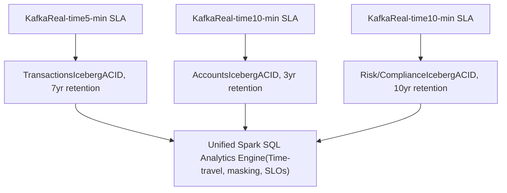

# Chakra Commerce — Fintech Data Mesh

## Production-Grade Zero-Copy Lakehouse with Decentralized Data Ownership

A reference implementation demonstrating how fintech platforms can scale compliance-aware analytics through data mesh architecture, Apache Iceberg lakehouse storage, and federated governance.

**Built for:** Financial institutions adopting decentralized data ownership while maintaining unified analytics, real-time streaming, and enterprise compliance (PCI-DSS, AML, SOX).

---

## 🎯 The Challenge

Traditional centralized data warehouses create bottlenecks:
- **Compliance friction**: Single governance model for all data domains (risk data ≠ marketing data)
- **Latency tradeoffs**: Real-time streaming OR cost-optimized analytics, not both
- **Domain lock-in**: Data teams depend on central ETL team for schema changes
- **Scale limits**: One catalog, one security model, one SLA for all domains

---

## ✨ The Solution: Data Mesh Lakehouse



**Key Principles:**
- **Decentralized ownership**: Each domain manages its own data, schema, SLAs
- **Federated governance**: OPA policies (not roles) enforce compliance across domains
- **Real-time + analytics duality**: Kafka for freshness, Iceberg for cost and time-travel
- **Data products**: Formal contracts with SLAs, quality rules, masking policies
- **Self-service discovery**: Portal for finding, requesting access to, consuming data

---

## 🏗️ Architecture at a Glance

| Component | Purpose | Technology |
|-----------|---------|-----------|
| **Data Domains** | Autonomous ownership (Transactions, Accounts, Risk, Counterparties, Market Data) | Kafka + Spark Structured Streaming |
| **Lakehouse** | ACID schema evolution, time-travel, cost-optimized storage | Apache Iceberg + MinIO/S3 |
| **Analytics** | Unified Spark SQL queries across domains with masking | PySpark + Iceberg Catalog |
| **Governance** | Policy-as-code for ABAC, compliance, retention, masking | OPA (Open Policy Agent) |
| **Discovery** | Self-service access to data products | FastAPI + Elasticsearch |
| **Observability** | Freshness SLOs, ingest/query metrics, quality dashboards | Prometheus + Grafana |

---

## 📊 Real-World Fintech Scenarios

### Scenario 1: Risk Dashboard with Compliance Masking
A risk analyst queries `risk_compliance.fraud_scores` + `transactions.transaction_feed` for suspicious patterns. OPA policies automatically:
- ✅ Grant read access (analyst has `risk_analyst` role)
- ✅ Mask PII columns (account_holder_name → hash, merchant_id → partial)
- ✅ Log audit trail (timestamp, user, query, rows accessed)
- ✅ Enforce retention (10-year SOX requirement for AML)

### Scenario 2: Real-Time Market Data Feed
Market Data domain publishes FX rates every minute to Kafka (`market-rates-raw`). MarketDataIngestJob micro-batches to Iceberg every 5 minutes:
- Hot path: Kafka stream for live dashboard (1-min freshness, 99% availability SLA)
- Cold path: Iceberg for historical analysis, compliance audits, cost optimization

### Scenario 3: New Domain Onboarding (Customer Behavior)
Finance team wants to add customer behavior analytics. Data mesh pattern allows:
- **Day 1**: Define schema (Avro), ingest job (Spark), data product spec (SLA + access policy)
- **Day 2**: Register OPA policy for governance (approval workflows for sensitive columns)
- **Day 3**: Data available in discovery portal, other teams can request access

---

## 🚀 Quick Start

### 1. Local Setup (5 minutes)
```bash
cd chakraview-fintech-data-mesh

# Install dependencies
make install

# Start services (Kafka, Iceberg, Postgres, MinIO, Prometheus, Grafana, OPA)
make docker-up

# Run tests
make test

# Start ingest jobs
python -m domains.transactions.ingest.ingest_job
python -m domains.risk_compliance.ingest.ingest_job
```

### 2. Query Across Domains
```sql
-- Unified Spark SQL across decentralized domains
SELECT 
  t.transaction_id,
  t.merchant_id,
  r.fraud_score,
  CASE WHEN r.risk_level = 'CRITICAL' THEN 'BLOCK' ELSE 'ALLOW' END as decision
FROM transactions.raw_transactions t
INNER JOIN risk_compliance.fraud_scores r 
  ON t.transaction_id = r.transaction_id
WHERE r.evaluated_at > '2026-04-30 00:00:00'
  AND t.booking_timestamp > current_date - INTERVAL 7 days;
```

### 3. Access Data Product
```bash
# Self-service discovery
curl http://localhost:8000/api/products?query=fraud_scores

# Request access (with justification)
curl -X POST http://localhost:8000/api/access-requests \
  -H "Content-Type: application/json" \
  -d '{
    "user_id": "analyst_42",
    "user_role": "risk_analyst",
    "data_product_id": "fraud-scoring",
    "action": "read",
    "justification": "Weekly fraud analysis for executive report"
  }'
```

---

## 📚 Documentation Map

- **[Architecture Overview](architecture/00-overview.md)** — Data mesh patterns, decentralized governance, Iceberg benefits
- **[Iceberg Design](architecture/iceberg-design.md)** — Schema evolution, ACID transactions, partitioning strategy
- **[Real-Time vs Analytics](architecture/real-time-vs-analytics.md)** — Kafka hot path vs Iceberg cold path trade-offs
- **[Domain Walkthroughs](domains/transactions.md)** — 5 autonomous domains with schemas, SLAs, quality rules
- **[Governance & OPA](platform/governance.md)** — Attribute-based access control, compliance enforcement
- **[Discovery Portal](platform/discovery.md)** — Self-service data product catalog and access requests
- **[Observability](platform/observability.md)** — SLO dashboards, freshness metrics, quality alerts
- **[Production Deployment](production/deployment.md)** — Kubernetes, Helm charts, scaling guidance
- **[Trade-offs Guide](production/trade-offs.md)** — When to use data mesh, micro-batches vs streaming, Iceberg vs Delta
- **[Architecture Decision Records](adrs/README.md)** — Why we chose data mesh, Iceberg, OPA, and hybrid real-time strategy

---

## 🎓 Learning Path

1. **Architects**: Start with [Architecture Overview](architecture/00-overview.md) + [Trade-offs Guide](production/trade-offs.md)
2. **Engineers**: Quick Start above → [Domain Walkthroughs](domains/transactions.md) → [Production Deployment](production/deployment.md)
3. **Data Product Owners**: [Governance & OPA](platform/governance.md) → [Discovery Portal](platform/discovery.md)
4. **Decision Makers**: [Trade-offs Guide](production/trade-offs.md) → [ADRs](adrs/README.md)

---

## 💡 Key Insights

### Why Decentralized Ownership?
- **Faster iteration**: Domain teams own their schema, SLAs, policies (no ETL bottleneck)
- **Compliance alignment**: Risk data policies ≠ marketing data policies
- **Cost control**: Each domain optimizes retention, partitioning independently
- **Scaling**: Add domains without changing central platform

### Why Iceberg?
- **Schema evolution**: Add/drop/rename columns without full rewrite
- **ACID semantics**: Time-travel for audit trails, exactly-once ingest
- **Cost**: Column-oriented compression, partition pruning
- **Compatibility**: Works with Spark, Presto, Flink, Trino

### Why OPA for Governance?
- **Policy-as-code**: Compliance rules version controlled, testable
- **Decoupled**: Policies independent of application code
- **Flexible**: Role-based + attribute-based (data classification, column sensitivity)
- **Auditable**: Every policy decision logged

---

## 📞 Next Steps

- **Explore**: Read [Architecture Overview](architecture/00-overview.md) for design rationale
- **Build**: Follow [Production Deployment](production/deployment.md) for enterprise rollout
- **Extend**: Add a new domain following [Domain Walkthroughs](domains/transactions.md) pattern
- **Govern**: Set up OPA policies with [Governance & OPA](platform/governance.md)

---

**Status**: Production-ready reference implementation with 5 fintech domains, 8 services, 60+ tasks completed.

**Last Updated**: 2026-04-30 | **Version**: 1.0 | **License**: MIT
