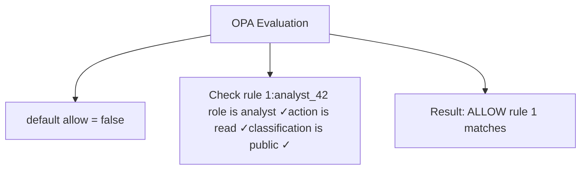
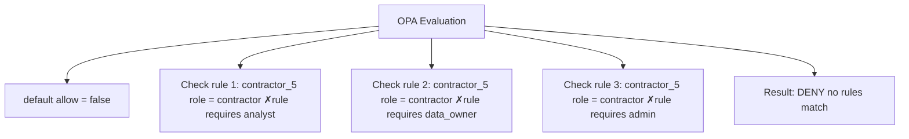
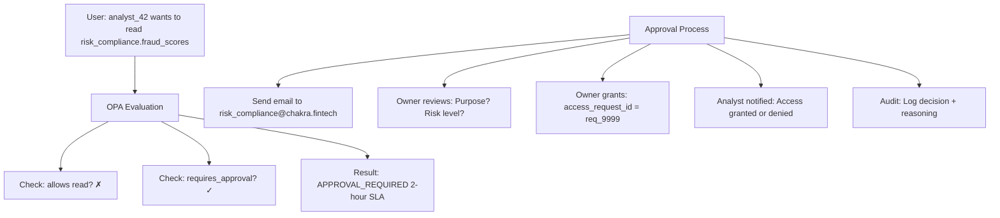
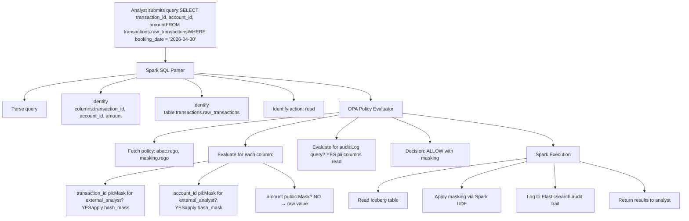

# Governance & Federated Policies

Compliance and access control through Open Policy Agent (OPA), not roles.

---

## Principle: Policy-as-Code

Traditional systems use roles: "marketing_analyst" role has read access to customer_data. This breaks at scale:

**Problems with role-based access:**
- New data types (PII, genetic info, financial) need new roles
- 100+ roles becomes unmanageable
- Role definitions change across organizations
- Difficult to enforce consistent policies

**Solution: Attribute-Based Access Control (ABAC)**

Policies evaluate attributes at query time:
```rego
allow {
  input.user_role == "analyst"          # User attribute
  input.action == "read"                # Action attribute
  input.data_classification != "pii"    # Data attribute
}
```

Each time a user queries data, OPA evaluates the policy and makes a decision. Same user + same data + same action = same decision. Different context (different role, different classification) = different decision.

---

## OPA Policy Examples

### 1. Default Deny (Zero-Trust)

```rego
# From platform/governance/opa-policies/abac.rego

default allow = false

allow {
  input.action == "read"
  input.user_role == "analyst"
  input.data_classification != "restricted"
}

allow {
  input.user_role == "data_owner"
}

allow {
  input.user_role == "admin"
}
```

**Decision flow**:

Query 1: Can analyst_42 read transactions.raw_transactions?



Query 2: Can contractor_5 write to market_data.fx_rates?



### 2. PII Masking Rules

```rego
# Mask PII columns for external users

mask_pii {
  input.user_role == "external_analyst"
  input.column_classification == "pii"
  input.action == "read"
}

apply_masking[reason] {
  mask_pii
  reason := "external_analyst viewing PII column"
  masking_strategy := "full_hash"
}
```

**When analyst queries transactions.raw_transactions**:
```sql
SELECT transaction_id, account_id, account_holder_name, amount
FROM transactions.raw_transactions;
```

**OPA intercepts**:

```mermaid
graph TD
    A["Column: transaction_id"]
    A --> A1["Classification: pii"]
    A --> A2["User role: external_analyst"]
    A --> A3["Applies mask_pii rule? ✓"]
    A --> A4["Masking strategy: full_hash"]
    A --> A5["Result: Hash value returned"]
    
    B["Column: amount"]
    B --> B1["Classification: public"]
    B --> B2["User role: external_analyst"]
    B --> B3["Applies mask_pii rule? ✗public != pii"]
    B --> B4["Result: Raw value returned"]
    
    C["Column: account_holder_name"]
    C --> C1["Classification: pii"]
    C --> C2["User role: external_analyst"]
    C --> C3["Applies mask_pii rule? ✓"]
    C --> C4["Masking strategy: full_hash"]
    C --> C5["Result: Hash value returned"]
```



### 3. Approval Workflows

```rego
# Sensitive data requires approval

requires_approval[reason] {
  input.data_classification == "restricted"
  input.action == "read"
  reason := "Restricted data requires approval"
  approval_sla_hours := 2
}

requires_approval[reason] {
  input.action == "write"
  input.data_classification in ["confidential", "restricted"]
  reason := "Write operations require approval"
  approval_sla_hours := 1
}

# Risk/Compliance domain data requires escalated approval
requires_escalation {
  input.domain == "risk_compliance"
  input.user_role == "contractor"
  escalation_level := "manager"
}
```

**Workflow**:



### 4. Retention Enforcement

```rego
# Enforce minimum and maximum retention policies

enforce_retention[violation] {
  input.retention_years < 1
  input.domain == "transactions"
  violation := "Transactions must retain >= 7 years (SOX)"
}

enforce_retention[violation] {
  input.retention_years > 10
  violation := "Data should not exceed 10-year retention without justification"
}

enforce_retention[violation] {
  input.domain == "risk_compliance"
  input.retention_years < 10
  violation := "Risk/Compliance data must retain >= 10 years (AML)"
}
```

### 5. Audit Trail Requirement

```rego
# All queries to sensitive data must be audited

audit_required {
  input.data_classification in ["pii", "confidential", "restricted"]
  input.action == "read"
}

# Queries to sensitive data trigger logging
log_query {
  audit_required
  log_entry := {
    "timestamp": input.timestamp,
    "user_id": input.user_id,
    "user_role": input.user_role,
    "data_domain": input.domain,
    "data_table": input.table,
    "rows_scanned": input.rows_scanned,
    "masking_applied": input.masking_applied
  }
}
```

---

## Policy Testing

OPA policies should be tested like code:

```rego
# policy_test.rego

package authz_test

import data.authz

test_allow_analyst_read_public {
  authz.allow with input as {
    "user_role": "analyst",
    "action": "read",
    "data_classification": "public"
  }
}

test_deny_analyst_write {
  not authz.allow with input as {
    "user_role": "analyst",
    "action": "write",
    "data_classification": "public"
  }
}

test_deny_external_read_pii {
  not authz.allow with input as {
    "user_role": "external_analyst",
    "action": "read",
    "data_classification": "pii",
    "masking_required": true
  }
}

test_require_approval_restricted {
  authz.requires_approval with input as {
    "user_role": "analyst",
    "action": "read",
    "data_classification": "restricted"
  }
}
```

**Run tests**:
```bash
opa test platform/governance/opa-policies/policy_test.rego -v
```

---

## Data Classification

### Public
- No access restrictions
- Examples: Transaction amounts, merchant names, public exchange rates
- Masking: Never

### Sensitive
- Internal users only (not contractors, not external)
- Examples: Account balances, customer names, fee percentages
- Masking: For external analysts, show coarse-grained summaries

### Confidential
- Approval required for access
- Examples: Credit limits, fraud scores, KYC verdicts
- Masking: Mask for all but authorized roles

### Restricted
- Highly sensitive; escalated approval
- Examples: Full fraud scoring reasons, sanctions match details
- Masking: Always masked; only authorized (data owners, auditors) see unmasked

### PII (Personally Identifiable Information)
- Special handling: account_id, customer_name, phone, email, SSN
- Masking: hash_mask (show first N chars + hash), partial_mask (show first/last), full_mask

---

## Integration: How Spark Reads OPA Policies

### Query Execution Flow



### Code Implementation

```python
# From platform/governance/opa_evaluator.py

import requests
import json
from typing import Dict, List

class OPAEvaluator:
    def __init__(self, opa_url: str = "http://opa:8181"):
        self.opa_url = opa_url

    def evaluate_access(self, context: Dict) -> Dict:
        """
        context = {
            "user_id": "analyst_42",
            "user_role": "external_analyst",
            "action": "read",
            "domain": "transactions",
            "table": "raw_transactions",
            "columns": ["transaction_id", "account_id", "amount"],
            "data_classifications": {
                "transaction_id": "pii",
                "account_id": "pii",
                "amount": "public"
            }
        }
        """
        
        # Query OPA for policy decision
        response = requests.post(
            f"{self.opa_url}/v1/data/authz",
            json={"input": context}
        )
        
        decision = response.json()["result"]
        
        return {
            "allowed": decision.get("allow", False),
            "requires_approval": decision.get("requires_approval", False),
            "masking_rules": decision.get("masking_rules", {}),
            "audit_required": decision.get("audit_required", False)
        }

    def get_masking_strategy(self, 
                           column: str, 
                           classification: str,
                           user_role: str) -> str:
        """Return masking strategy for a column"""
        context = {
            "column": column,
            "column_classification": classification,
            "user_role": user_role,
            "action": "read"
        }
        
        response = requests.post(
            f"{self.opa_url}/v1/data/authz/masking_strategy",
            json={"input": context}
        )
        
        return response.json()["result"].get("strategy", "no_mask")
```

---

## Masking Strategies

### no_mask
Return raw value unchanged.

### full_hash
```
Value: "John Doe"
Hash: hash("John Doe") = "3f4a9c8b7e2d1f6a5b8c9d0e1f2a3b4c"
Result: "3f4a9c8b7e2d1f6a5b8c9d0e1f2a3b4c"
```

### hash_mask (first N chars + hash)
```
Value: "John Doe"
First 2 chars: "Jo"
Hash rest: hash("hn Doe") = "9e7d6c5b4a3f2e1d"
Result: "Jo...9e7d6c5b4a3f2e1d"
```

### partial_mask (first + last chars)
```
Value: "12345-6789-0123-4567" (credit card)
First 4: "1234"
Last 4: "4567"
Result: "1234-****-****-4567"
```

### show_coarse_grained (Risk level only)
```
Value: fraud_score = 0.95 (CRITICAL)
Result: "CRITICAL" (no score visible)
```

---

## Compliance Policies

### PCI-DSS (Payment Card Industry)
```rego
# Mask card numbers from all but payments team
mask_pci {
  input.column_type == "credit_card_number"
  input.user_role != "payments_analyst"
  input.user_role != "payments_manager"
}

# Encrypt card data in transit (enforced at infrastructure level)
enforce_pci_transit_encryption {
  input.column_type == "credit_card_number"
  input.transport_protocol != "tls_1_2_plus"
}
```

### AML/Anti-Money Laundering
```rego
# Audit all fraud score queries (suspicious activity detection)
enforce_aml_audit {
  input.domain == "risk_compliance"
  input.table in ["fraud_scores", "kyc_verdicts", "sanctions_match"]
  audit_required := true
  retention_years := 10
}

# Alerts for policy violations
aml_alert {
  input.fraud_score > 0.9
  input.not_reviewed_within_hours := 2
}
```

### GDPR (Right to Deletion)
```rego
# Allow customer deletion requests
allow {
  input.action == "delete"
  input.user_role == "customer_privacy_officer"
  input.data_classification == "pii"
  has_deletion_request := true
}

# Log all deletion operations
log_deletion {
  input.action == "delete"
  input.data_classification == "pii"
}
```

---

## Approval SLA Matrix

| Data Classification | Approval Type | SLA | Escalation |
|-------------------|---------------|-----|-----------|
| Public | Auto-approve | None | None |
| Sensitive | Auto-approve (internal users only) | None | None |
| Confidential | Manager approval | 4 hours | Yes if > 4 hrs |
| Restricted | Director approval | 2 hours | Yes if > 2 hrs |
| PII (external) | Manager approval | 4 hours | Yes if > 4 hrs |

---

## Audit Trail Schema

Every query to sensitive data is logged:

```json
{
  "timestamp": "2026-04-30T11:45:23.456Z",
  "request_id": "req_abc123def456",
  "user_id": "analyst_42",
  "user_role": "external_analyst",
  "user_email": "analyst.42@company.com",
  "action": "read",
  "domain": "transactions",
  "table": "raw_transactions",
  "columns_requested": ["transaction_id", "account_id", "amount"],
  "rows_scanned": 1000000,
  "rows_returned": 100,
  "columns_masked": ["transaction_id", "account_id"],
  "masking_strategies": {
    "transaction_id": "full_hash",
    "account_id": "full_hash"
  },
  "query_hash": "abc123def456",
  "query_duration_seconds": 5.3,
  "status": "success",
  "error_message": null,
  "ip_address": "192.168.1.100",
  "policy_decisions": {
    "allowed": true,
    "requires_approval": false,
    "audit_required": true
  }
}
```

Audit logs stored in Elasticsearch for compliance queries.

---

## Testing the Governance System

### Unit Test Example

```python
# tests/governance/test_masking.py

def test_external_analyst_pii_masked():
    evaluator = OPAEvaluator()
    
    context = {
        "user_role": "external_analyst",
        "action": "read",
        "column": "account_id",
        "column_classification": "pii"
    }
    
    result = evaluator.evaluate_access(context)
    assert result["allowed"] == True
    assert result["masking_required"] == True
    assert result["masking_strategy"] == "full_hash"

def test_fraud_analyst_no_masking():
    evaluator = OPAEvaluator()
    
    context = {
        "user_role": "fraud_analyst",
        "action": "read",
        "column": "fraud_score",
        "column_classification": "restricted"
    }
    
    result = evaluator.evaluate_access(context)
    assert result["allowed"] == True
    assert result["masking_required"] == False

def test_contractor_restricted_data_denied():
    evaluator = OPAEvaluator()
    
    context = {
        "user_role": "contractor",
        "action": "read",
        "column": "fraud_score",
        "column_classification": "restricted"
    }
    
    result = evaluator.evaluate_access(context)
    assert result["allowed"] == False  # Requires approval, not auto-deny
    assert result["requires_approval"] == True
```

---

## Next Steps

- **[Discovery Portal](discovery.md)** — How users find and request data
- **[Observability](observability.md)** — Monitor governance enforcement
- **[Transactions Domain](../domains/transactions.md)** — See governance in action
