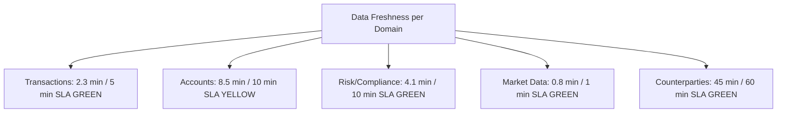
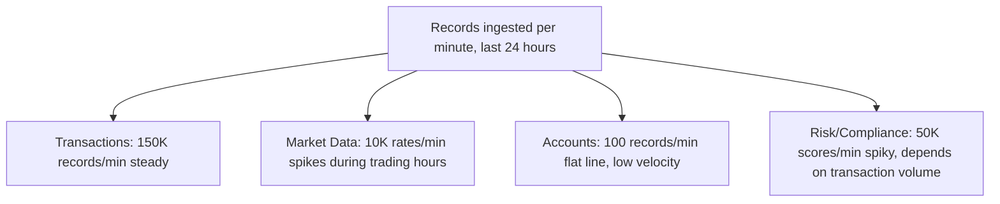
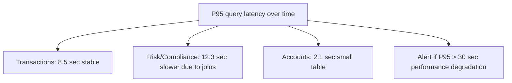
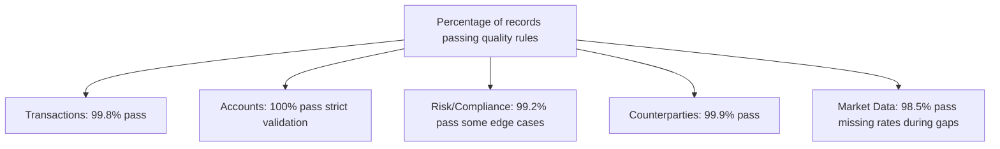
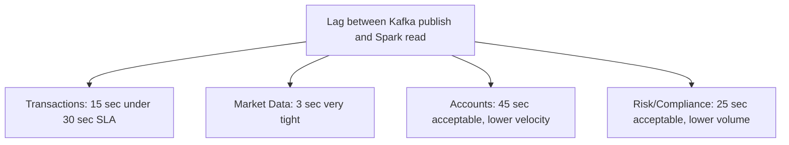
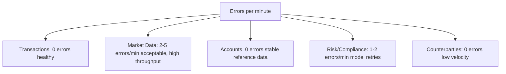

# Observability: SLO Monitoring & Alerting

Comprehensive monitoring of data mesh health through Prometheus metrics and Grafana dashboards.

---

## Core Metrics

### Ingest Path Metrics

**ingest_records_total** - Counter
```
ingest_records_total{domain="transactions", table="raw_transactions", status="success"}
ingest_records_total{domain="transactions", table="raw_transactions", status="failed"}
ingest_records_total{domain="market_data", table="fx_rates", status="success"}
```

**ingest_duration_seconds** - Histogram
```
ingest_duration_seconds{domain="transactions", quantile="0.95"}  # P95 latency
ingest_duration_seconds{domain="transactions", quantile="0.99"}  # P99 latency
```

**ingest_errors_total** - Counter
```
ingest_errors_total{domain="transactions", error_type="schema_validation"}
ingest_errors_total{domain="transactions", error_type="iceberg_write"}
```

### Freshness Metrics

**data_freshness_minutes** - Gauge
```
data_freshness_minutes{domain="transactions", table="raw_transactions"}  # Current value: 2.3
data_freshness_minutes{domain="risk_compliance", table="fraud_scores"}  # Current value: 4.1
data_freshness_minutes{domain="market_data", table="fx_rates"}          # Current value: 0.8
```

Definition: `now() - last_iceberg_snapshot_timestamp` (in minutes)

**SLA Thresholds**:
```yaml
domain: transactions
  table: raw_transactions
  freshness_sla_minutes: 5
  warning_threshold: 3  (60% of SLA)
  critical_threshold: 5 (100% of SLA)

domain: market_data
  table: fx_rates
  freshness_sla_minutes: 1
  warning_threshold: 0.5
  critical_threshold: 1
```

### Query Performance Metrics

**query_duration_seconds** - Histogram
```
query_duration_seconds{domain="transactions", quantile="0.50"}  # P50: 1.2 sec
query_duration_seconds{domain="transactions", quantile="0.95"}  # P95: 8.5 sec
query_duration_seconds{domain="transactions", quantile="0.99"}  # P99: 15.2 sec
```

**queries_total** - Counter
```
queries_total{domain="transactions", status="success"}
queries_total{domain="transactions", status="timeout"}
queries_total{domain="transactions", status="error"}
```

### Quality Metrics

**quality_checks_passed** - Counter
```
quality_checks_passed{domain="transactions", rule="positive_amount"}
quality_checks_passed{domain="transactions", rule="valid_settlement_date"}
```

**quality_check_failure_rate** - Gauge
```
quality_check_failure_rate{domain="transactions"}  # Current: 0.002 (0.2% failure rate)
```

Alert if failure_rate > 0.01 (> 1% failures indicate data quality issue).

### Kafka Lag Metrics

**kafka_lag_seconds** - Gauge
```
kafka_lag_seconds{domain="transactions", consumer_group="transaction-ingest"}
kafka_lag_seconds{domain="market_data", consumer_group="market-data-ingest"}
```

Definition: `current_time - last_message_timestamp` in Kafka partition

**Alert Thresholds**:
```yaml
domain: transactions
  lag_warning: 30 seconds
  lag_critical: 60 seconds

domain: market_data
  lag_warning: 10 seconds
  lag_critical: 30 seconds
```

---

## Grafana Dashboards

### Dashboard 1: Data Mesh Health Overview

6 panels showing system health:

**1. Data Freshness Gauge**



**2. Ingest Record Rate Time Series**



**3. Query Duration Time Series**



**4. Quality Check Pass Rate Gauge**



**5. Kafka Lag Time Series**



**6. Ingest Errors Time Series**



### Dashboard 2: Transactions Domain Deep-Dive

Drill-down for transactions domain:

```mermaid
graph TD
    A["Panel 1: Raw Transactions Freshness"]
    A --> A1["Current: 2.3 minutes"]
    A --> A2["SLA: 5 minutes"]
    A --> A3["Status: GREEN"]
    A --> A4["Trend: Stable last 24 hours"]
    
    B["Panel 2: Micro-Batch Success Rate"]
    B --> B1["Last 24 hours: 287 batches"]
    B --> B2["Successful: 286 99.7%"]
    B --> B3["Failed: 1 0.3% retried and succeeded"]
    B --> B4["Average batch size: 500K records"]
    
    C["Panel 3: Iceberg Write Latency"]
    C --> C1["P50: 5.2 sec"]
    C --> C2["P95: 18.3 sec"]
    C --> C3["P99: 32.1 sec"]
    C --> C4["Max: 47.5 sec normal variance"]
    
    D["Panel 4: Partition Statistics"]
    D --> D1["Partitions per day: 4 year, month, day, account_id"]
    D --> D2["Files per partition: avg 3.2"]
    D --> D3["Size per partition: avg 500MB"]
```


└── Scan efficiency: 85% (partition pruning working)

Panel 5: Data Volume Growth
├── Daily growth: 42GB/day
├── 7-year retention: 10.7TB
├── Compression ratio: 60% (150GB uncompressed → 100GB Iceberg)
└── Cost/year: ~$2.3K (S3 storage at $0.023/GB/month)

Panel 6: Access Requests (24h)
├── Submitted: 15
├── Auto-approved: 12
├── Pending approval: 2
├── Denied: 1
└── Average approval time: 45 minutes
```

### Dashboard 3: Governance & Compliance

Track governance effectiveness:

```
Panel 1: Masked Column Access
├── account_id (PII): Masked for 8 users (external_analyst)
├── merchant_id (Confidential): Masked for 5 users
├── transaction_id: Not masked
└── Status: All masking rules enforced

Panel 2: Query Audit Trail
├── Total queries (24h): 342
├── Queries with PII: 89 (26%)
├── Queries audited: 89 (100%)
└── Audit lag: < 100ms

Panel 3: Approval SLA Compliance
├── Access requests: 15 submitted
├── Approved within SLA: 15/15 (100%)
├── Average approval time: 45 min
├── SLA threshold: 4 hours
└── Status: COMPLIANT

Panel 4: Retention Policy Enforcement
├── Transactions (7-year policy): ✓ Enforced
├── Risk/Compliance (10-year policy): ✓ Enforced
├── Market Data (1-year policy): ✓ Enforced
├── Snapshots auto-deleted: 45 (90+ days old)
└── Status: All policies enforced
```

---

## Alert Rules (Prometheus)

### Critical Alerts (Page On-Call)

```yaml
alert: data_freshness_sla_violated
description: "{{ $labels.domain }}.{{ $labels.table }} is {{ $value }} minutes old (SLA: {{ $labels.sla_minutes }} min)"
expr: |
  data_freshness_minutes > on(domain, table) group_left() data_freshness_sla_minutes
for: 5m
severity: critical
action: "Investigate ingest job; check Spark logs; verify Kafka availability"

alert: quality_check_failure_rate_high
description: "{{ $labels.domain }} quality check failure rate is {{ $value }}% (threshold: 1%)"
expr: |
  (quality_checks_failed / (quality_checks_passed + quality_checks_failed)) > 0.01
for: 10m
severity: critical
action: "Review quality rules; check data source for anomalies"

alert: kafka_lag_critical
description: "{{ $labels.domain }} Kafka lag is {{ $value }}s (threshold: {{ $labels.critical_threshold }}s)"
expr: |
  kafka_lag_seconds > on(domain) group_left() kafka_lag_critical_seconds
for: 5m
severity: critical
action: "Verify Spark job health; check Kafka broker health; scale Spark if needed"
```

### Warning Alerts (Email)

```yaml
alert: data_freshness_approaching_sla
description: "{{ $labels.domain }}.{{ $labels.table }} freshness at {{ $value }}m (SLA: {{ $labels.sla_minutes }}m)"
expr: |
  data_freshness_minutes > (data_freshness_sla_minutes * 0.6)
for: 5m
severity: warning
action: "Monitor; ingest job may be slow due to high volume or cluster load"

alert: query_latency_high
description: "{{ $labels.domain }} P95 query latency: {{ $value }}s (threshold: 30s)"
expr: |
  histogram_quantile(0.95, query_duration_seconds) > 30
for: 10m
severity: warning
action: "Check Spark/Iceberg performance; consider query optimization or scaling"

alert: ingest_error_rate_elevated
description: "{{ $labels.domain }} error rate: {{ $value }}% (threshold: 0.5%)"
expr: |
  (ingest_errors_total / ingest_records_total) > 0.005
for: 15m
severity: warning
action: "Investigate error types; may need schema validation fix or retry logic"
```

---

## Metrics Collection Implementation

```python
# From platform/observability/metrics_exporter.py

from prometheus_client import Counter, Histogram, Gauge, start_http_server
import time

class MetricsCollector:
    def __init__(self):
        # Ingest metrics
        self.ingest_records = Counter(
            'ingest_records_total',
            'Records ingested',
            ['domain', 'table', 'status']
        )
        
        self.ingest_duration = Histogram(
            'ingest_duration_seconds',
            'Duration of ingest batch',
            ['domain'],
            buckets=[10, 30, 60, 120, 300]
        )
        
        # Freshness metrics
        self.data_freshness = Gauge(
            'data_freshness_minutes',
            'Minutes since last snapshot',
            ['domain', 'table']
        )
        
        # Quality metrics
        self.quality_checks = Counter(
            'quality_checks_total',
            'Quality checks executed',
            ['domain', 'rule', 'status']
        )
        
        # Query metrics
        self.query_duration = Histogram(
            'query_duration_seconds',
            'Query execution duration',
            ['domain'],
            buckets=[1, 5, 10, 30, 60]
        )
        
        # Kafka metrics
        self.kafka_lag = Gauge(
            'kafka_lag_seconds',
            'Seconds behind latest Kafka offset',
            ['domain', 'topic']
        )

    def record_ingest_success(self, domain: str, table: str, count: int, duration: float):
        self.ingest_records.labels(domain=domain, table=table, status="success").inc(count)
        self.ingest_duration.labels(domain=domain).observe(duration)
        
        # Update freshness
        self.data_freshness.labels(domain=domain, table=table).set(0.1)

    def update_freshness(self, domain: str, table: str, minutes_old: float):
        self.data_freshness.labels(domain=domain, table=table).set(minutes_old)

# Start Prometheus HTTP server on port 8001
if __name__ == "__main__":
    start_http_server(8001)
    collector = MetricsCollector()
    # Collectors update metrics as ingest jobs run
```

---

## Querying Metrics

### Prometheus Query Examples

```
# Current freshness
data_freshness_minutes{domain="transactions"}

# Ingest rate (records per minute)
rate(ingest_records_total[1m]) * 60

# P95 query latency
histogram_quantile(0.95, query_duration_seconds)

# Quality check success rate
(quality_checks_total{status="passed"} / quality_checks_total) * 100

# Kafka lag
kafka_lag_seconds
```

---

## Health Check Endpoints

### /health
```bash
curl http://localhost:8000/health

{
  "status": "healthy",
  "components": {
    "kafka": {
      "status": "connected",
      "brokers": ["kafka:9092"]
    },
    "iceberg_catalog": {
      "status": "connected",
      "uri": "http://iceberg-catalog:8181"
    },
    "opa": {
      "status": "connected",
      "uri": "http://opa:8181"
    },
    "elasticsearch": {
      "status": "connected",
      "cluster_health": "green"
    }
  },
  "freshness_lag": {
    "transactions": "2.3 minutes",
    "market_data": "0.8 minutes"
  }
}
```

---

## Next

- **[Transactions Domain](../domains/transactions.md)** — See how freshness SLOs are enforced
- **[Production Deployment](../production/deployment.md)** — Deploy Prometheus + Grafana
- **[Trade-offs](../production/trade-offs.md)** — Understand SLA design decisions
