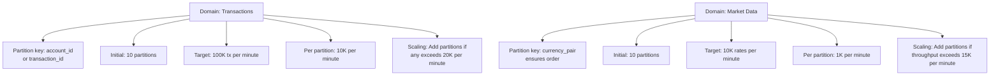
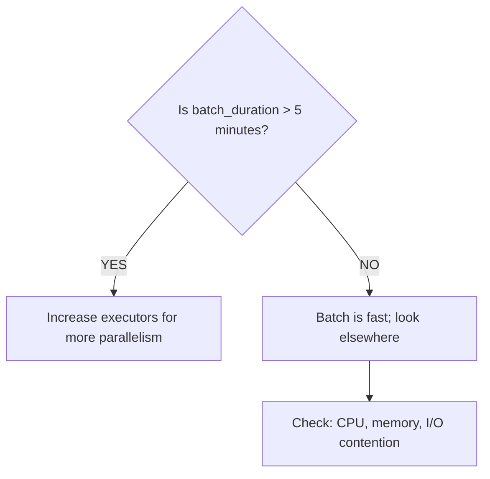

# Scaling Guide: Production Operations

Production-grade scaling strategies for each domain and component.

---

## Horizontal Scaling: The Principles

### 1. Kafka Partitioning (Hot Path Scale)

**Partition Key**: Should distribute evenly across partitions



**Increase Partitions**:
```bash
kafka-topics.sh --bootstrap-server kafka:9092 \
  --alter --topic market-transactions-raw --partitions 20
```

**Impact**: Spark consumer group scales to match (up to partition count).

### 2. Spark Executor Scaling (Cold Path Scale)

**Scaling Decision Tree**:



**Executor Configuration**:
```yaml
# domains/transactions/ingest/config.yaml
spark:
  executors: 10              # Increase from 5 to 10
  executor_cores: 8          # CPU parallelism
  executor_memory: 16Gi      # RAM per executor
  driver_memory: 4Gi
  
  # Tuning parameters
  spark.default.parallelism: 80  # cores × executors
  spark.sql.shuffle.partitions: 200  # Shuffle parallelism
  spark.driver.maxResultSize: 2g   # Driver memory for results
```

**Scale Spark Job**:
```bash
# Via Kubernetes
kubectl set resources deployment transaction-ingest-job \
  --limits=cpu=32,memory=64Gi \
  --requests=cpu=16,memory=32Gi

# Via Helm
helm upgrade fintech-mesh ./helm \
  --set spark.executors=10 \
  --set spark.executor_cores=8
```

### 3. Iceberg Table Scaling (Storage Scale)

**Partition Count Impact**:

```mermaid
graph TD
    A["Table: transactions.raw_transactions"]
    A --> A1["Partition spec: year, month, day, account_id"]
    A --> A2["Data volume: 1B tx/year × 50 bytes = 50GB/year"]
    A --> A3["7-year retention: 350GB uncompressed"]
    A --> A4["With Iceberg compression: 100GB total"]
    
    B["Partitions per day"]
    B --> B1["year: 1 same for all data"]
    B --> B2["month: 12 1-12"]
    B --> B3["day: 30 avg, 1-31"]
    B --> B4["account_id: 10M unique accounts"]
    B --> B5["Total: 1 × 12 × 30 × 10M = 3.6B partitions"]
    
    C["But Iceberg uses hidden partitions efficient"]
    C --> C1["Only create partitions with data"]
    C --> C2["Typical: 360K partitions/year 1 per day-account combo with data"]
    C --> C3["File count per partition: 2-5 files daily Spark batch"]
```



**Optimize Partitions**:
```python
# If partition count > 1M, consider dropping account_id partition
# and add it to column-level partitioning instead

# Old: [year, month, day, account_id]
# New: [year, month, day]  # Partition at year/month/day level
# account_id remains as column (more efficient for queries filtering by account)

table.update_spec() \
    .remove_field("account_id") \
    .commit()
```

**Compaction** (Reduce File Count):
```python
# Run weekly to merge old files
from pyiceberg.catalog import load_catalog

catalog = load_catalog("rest")
table = catalog.load_table("transactions.raw_transactions")

# Compact files older than 30 days
table.compact([
    ("snapshot_id", ">", 30_days_ago_snapshot_id)
])
```

---

## Vertical Scaling: When Horizontal Fails

### 1. Storage I/O Bottleneck

**Symptom**: Query latency spikes despite low CPU
```
SELECT * FROM transactions.raw_transactions
WHERE booking_timestamp > now() - INTERVAL 7 days

Scan: 365 partitions
Files per partition: 5
Total files: 1,825
I/O time: 45 seconds (should be < 10)
```

**Diagnosis**:
```bash
# Check Iceberg file statistics
spark.sql("""
  SELECT 
    partition,
    COUNT(*) as file_count,
    SUM(file_size_bytes) / (1024*1024*1024) as size_gb
  FROM iceberg_metadata
  WHERE table = 'transactions.raw_transactions'
  GROUP BY partition
  ORDER BY file_count DESC
  LIMIT 10
""")
```

**Solution**: Compaction
```bash
# Merge small files into larger ones
kubectl run -it iceberg-compact \
  --image=apache/spark:3.3.0 \
  --command -- spark-submit \
  --class org.apache.iceberg.spark.actions.CompactAction \
  s3://bucket/iceberg-compact.jar \
  transactions.raw_transactions
```

### 2. Memory Bottleneck (Spark Executor OOM)

**Symptom**: Executors crash with OutOfMemory
```
java.lang.OutOfMemoryError: Java heap space
```

**Cause**: Shuffle spilling, large joins, broadcast variables

**Solutions**:
```yaml
# Option 1: Increase executor memory
spark.executor_memory: 16Gi  # → 32Gi

# Option 2: Reduce batch size
spark.streaming.kafka.maxRatePerPartition: 10000  # → 5000

# Option 3: Enable external shuffle
spark.shuffle.manager: org.apache.spark.shuffle.sort.SortShuffleManager
spark.local.dir: /tmp/spark-shuffle  # SSD preferred
```

### 3. Network Bottleneck (Data Shuffle)

**Symptom**: Queries with joins are slow
```
SELECT t.*, r.fraud_score
FROM transactions.raw_transactions t
JOIN risk_compliance.fraud_scores r
  ON t.transaction_id = r.transaction_id
Duration: 60 seconds
```

**Solution**: Broadcast join (if one table is small)
```python
from pyspark.sql.functions import broadcast

# Broadcast fraud_scores (< 1GB)
result = transactions.join(
    broadcast(fraud_scores),
    on="transaction_id"
)
```

---

## Domain-Specific Scaling Profiles

### Transactions Domain

```yaml
Current:
├── Kafka: 10 partitions, 150K msg/min
├── Spark: 5 executors, 4 cores each
├── Iceberg: 360K partitions, 1.8B files total

Scale Profile (3x growth):
├── Kafka: 30 partitions (maintain 5K/partition/min)
├── Spark: 15 executors (maintain batch window)
├── Iceberg: Compaction every 2 weeks (reduce files)

Cost Impact:
├── Kafka: 3x cluster size = 3x cost
├── Spark: 3x executors = 3x cost
├── Storage: Same (Iceberg doesn't scale with throughput)
└── Total: ~2.8x cost for 3x throughput
```

### Market Data Domain

```yaml
Current:
├── Kafka: 10 partitions, 10K rates/min (spiky during trading hours)
├── Spark: 2 executors (low latency requirement, not throughput)
├── Iceberg: 8K partitions, 40K files

Scale Profile (10x growth):
├── Kafka: 40 partitions (maintain 250/partition/min)
├── Spark: 5 executors (maintain < 1 min batch)
├── Iceberg: Hourly partitioning instead of [year,month,day,hour]

Note: Market data is spiky; peak load is trading hours only
└── Use auto-scaling: 2 executors (off-hours) → 10 (trading hours)
```

### Risk/Compliance Domain

```yaml
Current:
├── Kafka: 5 partitions, 50K scores/min
├── Spark: 3 executors (accuracy > speed)
├── Iceberg: 180K partitions, 900K files

Scale Profile (2x growth):
├── Kafka: 10 partitions
├── Spark: 5 executors
├── Iceberg: Compaction to merge files (don't add partitions)

Key constraint: OPA policy evaluation adds latency
└── Don't scale Spark beyond 10 executors (policy bottleneck)
```

---

## Cost Optimization During Scaling

### Reserved vs On-Demand Instances

```
Scenario: Scale from 5 to 15 Spark executors (3x)

Option 1: On-Demand (AWS m5.2xlarge)
├── Cost: $0.384/hour × 24 × 30 × 15 = $4,147/month
└── Flexibility: Scale up/down instantly

Option 2: Reserved Instances (1-year commitment)
├── Cost: $0.192/hour × 24 × 30 × 15 = $2,073/month
└── Savings: 50% over 1 year = $2,074/year

Option 3: Spot Instances (Amazon Savings)
├── Cost: $0.115/hour × 24 × 30 × 15 = $1,242/month
├── Savings: 68% over on-demand
└── Risk: Interruption (use for batch, not real-time)

Recommendation: Mix
├── Reserved for baseline (5 executors always running)
├── On-demand for peak hours (additional 10 executors)
└── Spot for overnight analytics (backup executors)
```

### Storage Cost Scaling

```
Scenario: 7-year retention, 1B tx/year, growing 20% YoY

Year 1: 50GB/year → 350GB total (Iceberg: 100GB)
Cost: 100GB × $0.023/GB/month = $2.3K/month = $27.6K/year

Year 3: 72GB/year → 500GB total (Iceberg: 145GB)
Cost: 145GB × $0.023/GB/month = $3.3K/month = $39.6K/year

Year 5: 103GB/year → 720GB total (Iceberg: 200GB)
Cost: 200GB × $0.023/GB/month = $4.6K/month = $55.2K/year

Optimization: Archive old data to Glacier
├── Hot (1 year): S3 Standard = $0.023/GB/month
├── Warm (1-3 years): S3 Intelligent-Tiering = $0.0125/GB/month
├── Cold (3-7 years): S3 Glacier = $0.004/GB/month
└── 7-year cost with tiering: $2.8K/month vs $4.6K/month (40% savings)
```

---

## Monitoring During Scale Events

### Critical Metrics

```yaml
During scale-up, monitor:
├── kafka_lag_seconds: Should stay < 30 sec
├── spark_batch_duration_seconds: Should improve (not degrade)
├── iceberg_write_latency_ms: Should stay < 500ms
├── query_duration_seconds_p95: Should improve (more parallelism)
├── executor_memory_usage_percent: Should decrease (more executors)
└── cpu_utilization_percent: Should stay 60-80% (not overprovisioned)

Red flags during scale-up:
├── kafka_lag increases → Spark still can't keep up; add more cores
├── query_latency unchanged → Check CPU/memory bottleneck
├── executor crashes (OOM) → Reduce batch size, increase memory
└── Network errors → Executor communication breaking down
```

### Pre-Scale Checklist

```
Before scaling up:
- [ ] Run load test at target throughput (2 hours)
- [ ] Monitor: CPU, memory, network, disk I/O
- [ ] Identify bottleneck (CPU? Memory? I/O?)
- [ ] Plan scaling (executors? partitions? storage?)
- [ ] Calculate cost increase
- [ ] Update monitoring thresholds
- [ ] Schedule scale during low-traffic window
- [ ] Have rollback plan (reduce executors in 5 min)

During scale:
- [ ] Monitor lag, latency, errors (real-time)
- [ ] Check logs for warnings/errors
- [ ] Verify SLAs still met (freshness, availability)

After scale:
- [ ] Run soak test (8 hours)
- [ ] Update runbooks with new capacities
- [ ] Document baseline metrics for next scale event
```

---

## Auto-Scaling Configuration

### Kubernetes Horizontal Pod Autoscaler (HPA)

```yaml
# kubernetes/hpa-ingest.yaml
apiVersion: autoscaling/v2
kind: HorizontalPodAutoscaler
metadata:
  name: transaction-ingest-hpa
spec:
  scaleTargetRef:
    apiVersion: apps/v1
    kind: Deployment
    name: transaction-ingest-job
  minReplicas: 2
  maxReplicas: 10
  metrics:
  - type: Resource
    resource:
      name: cpu
      target:
        type: Utilization
        averageUtilization: 70
  - type: Resource
    resource:
      name: memory
      target:
        type: Utilization
        averageUtilization: 80
  behavior:
    scaleDown:
      stabilizationWindowSeconds: 300  # Wait 5 min before scaling down
      policies:
      - type: Percent
        value: 50  # Scale down by 50% max
        periodSeconds: 60
    scaleUp:
      stabilizationWindowSeconds: 0  # Scale up immediately
      policies:
      - type: Percent
        value: 100  # Scale up by 100% max
        periodSeconds: 30
```

Deploy:
```bash
kubectl apply -f kubernetes/hpa-ingest.yaml
kubectl get hpa transaction-ingest-hpa --watch
```

---

## Next

- **[Production Deployment](deployment.md)** — Kubernetes setup and infrastructure
- **[Trade-offs](trade-offs.md)** — When to use data mesh vs. alternatives
