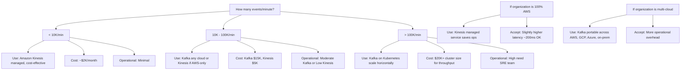
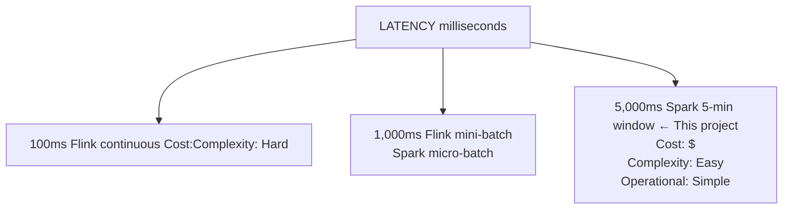
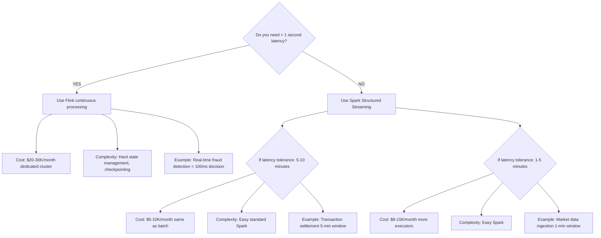

# Architecture Trade-Offs: When to Use Data Mesh

This project demonstrates fintech data mesh architecture. But when is it the right choice?

---

## Data Mesh vs Alternatives

### When Data Mesh Is Right

**Use Data Mesh if:**
- ✅ Multiple autonomous domains (Transactions, Risk, Accounts, etc.)
- ✅ Different compliance requirements per domain (PCI-DSS, AML, GDPR)
- ✅ Different SLAs per domain (Transactions = 5 min, Counterparties = 60 min)
- ✅ Large organization (teams can't coordinate on single schema)
- ✅ Long-term compliance retention (7-10 years)
- ✅ Real-time + analytical both needed (Kafka + Iceberg)

**Organization profile**: Large fintech, insurance, or pharma with regulatory requirements.

### When Data Mesh Is Wrong

**Don't use Data Mesh if:**
- ❌ Single domain (all data is same type: sales, marketing, etc.)
- ❌ Small team (coordination cost < benefit)
- ❌ Simple compliance (one regulation, uniform rules)
- ❌ Real-time only (no analytical queries needed)
- ❌ Short retention (< 1 year)
- ❌ Single SLA (everyone needs same freshness)

**Simpler alternative**: Centralized data warehouse (BigQuery, Redshift, Snowflake).

---

## Kafka vs Kinesis vs Pulsar (Hot Path)

### Trade-Off Matrix

| Aspect | Kafka | Kinesis | Pulsar |
|--------|-------|---------|--------|
| **Cost** | $5K-20K/month (self-hosted) | $2K-8K/month (managed) | $3K-12K/month (managed) |
| **Latency** | < 100ms | ~200ms | < 100ms |
| **Scale** | Linear with partitions | Hard limit per shard | Linear with partitions |
| **Replication** | 3x data (built-in) | 1x data (managed by AWS) | Configurable (default 3x) |
| **Operational Overhead** | High (manage cluster) | Low (AWS managed) | Medium (API-driven) |
| **Ecosystem** | Largest (Spark, Flink, etc.) | AWS-specific | Growing (Spark 3.3+) |
| **Lock-in** | Open source (portable) | AWS lock-in | Open source (portable) |

### Decision Framework



### Recommendation for This Project

**Chose Kafka because**:
- ✅ Multi-cloud portability (example for enterprises)
- ✅ Cost transparency (self-hosted = known costs)
- ✅ Ecosystem richness (works with Spark, Flink, Trino, etc.)
- ❌ Trade-off: Requires operational expertise (cluster management)

---

## Iceberg vs Delta Lake vs Hudi (Cold Path)

### Feature Comparison

| Feature | Iceberg | Delta Lake | Hudi |
|---------|---------|-----------|------|
| **ACID Transactions** | ✅ Yes | ✅ Yes | ✅ Yes |
| **Schema Evolution** | ✅ Excellent | ⚠️ Good | ⚠️ Good |
| **Time-Travel** | ✅ Yes (snapshots) | ✅ Yes (versions) | ⚠️ Limited |
| **Partition Pruning** | ✅ Hidden partitions | ⚠️ Manual | ⚠️ Manual |
| **Cost** | ✅ Columnar compression | ⚠️ Slightly higher | ✅ Efficient |
| **Ecosystem** | ✅ Spark, Flink, Trino, Presto | ⚠️ Spark + Databricks | ⚠️ Spark only |
| **Open Source** | ✅ Apache (pure) | ❌ Databricks-controlled | ✅ Apache |
| **Learning Curve** | ⚠️ Medium (manifests, snapshots) | ✅ Easy (familiar) | ⚠️ High (complex) |

### When to Choose

**Choose Iceberg if:**
- ✅ Schema evolution is frequent (add/remove columns)
- ✅ Time-travel queries needed (audit trails)
- ✅ Using multiple query engines (Spark + Presto + Flink)
- ✅ Want open source (not Databricks-controlled)
- ✅ Need partition pruning for performance

**Choose Delta Lake if:**
- ✅ Already using Databricks (unified stack)
- ✅ Team familiar with Delta syntax
- ✅ Don't need multi-engine querying
- ❌ Accept: Vendor lock-in to Databricks

**Choose Hudi if:**
- ✅ Need incremental ingestion (COW/MOR mode)
- ✅ High-frequency updates (not append-only)
- ❌ Accept: Limited ecosystem (Spark-only)
- ❌ Accept: Complex operations

### Recommendation for This Project

**Chose Iceberg because**:
- ✅ Multi-engine querying (Spark + Trino for reporting)
- ✅ Pure open-source (no vendor control)
- ✅ Schema evolution needed (domains evolve independently)
- ✅ Time-travel for compliance audits
- ❌ Trade-off: Steeper learning curve (manifests, snapshots)

---

## Spark Structured Streaming vs Flink vs Storm (Micro-Batches vs Continuous)

### Latency vs Cost vs Simplicity



### Decision Tree



### Recommendation for This Project

**Chose Spark because**:
- ✅ 5-minute latency acceptable for cold-path analytics
- ✅ Simple operational model (same as batch)
- ✅ Cost-effective (shared cluster with batch jobs)
- ✅ Ecosystem rich (Spark plugins everywhere)
- ❌ Trade-off: Can't do true sub-second streaming

**Fraud Detection Uses Kafka Directly** (hot path):
- Requires < 1-second decision time
- Real-time fraud detection reads Kafka directly (no Spark)
- Spark micro-batch (5 min) is for cold-path analytics

---

## OPA vs Ranger vs Keycloak (Governance)

### Governance Philosophy

| Tool | Philosophy | Deployment |
|------|-----------|-----------|
| **OPA** | Policy-as-code (Rego language) | Docker container, stateless |
| **Ranger** | UI-driven + code (Hadoop ecosystem) | Server + DB, stateful |
| **Keycloak** | Identity federation (OIDC/SAML) | Identity server, not access control |

### When to Use

**Use OPA if:**
- ✅ Need portability (works with any system)
- ✅ Want policy as code (versioned, testable)
- ✅ Willing to learn Rego language
- ✅ Not in Hadoop ecosystem

**Use Ranger if:**
- ✅ Already using Hadoop/Spark/Hive/Kafka (Ranger-integrated)
- ✅ Team familiar with UI-driven policies
- ✅ Need tight Hadoop integration
- ❌ Accept: Not portable outside Hadoop

**Use Keycloak if:**
- ⚠️ Need SSO/identity, not data access control
- ⚠️ Usually used alongside Ranger/OPA, not instead of

### Recommendation for This Project

**Chose OPA because**:
- ✅ Portability (works with Spark, FastAPI, Kubernetes, etc.)
- ✅ Policy-as-code fits "contracts-first" philosophy
- ✅ Testable policies (unit tests on governance rules)
- ✅ Not tied to Hadoop ecosystem
- ⚠️ Trade-off: Team must learn Rego (learning curve)

---

## Kubernetes vs Docker Compose vs Serverless (Deployment)

### When to Use Each

```
Complexity:
├── Docker Compose (local dev)
│   ├── Cost: $0 (your laptop)
│   ├── Ops overhead: Minimal
│   ├── Scale: Single machine only
│   └── Use: Development, learning
│
├── Kubernetes (production on-prem or cloud)
│   ├── Cost: $3-10K/month (managed EKS/GKE/AKS)
│   ├── Ops overhead: Moderate (need SRE team)
│   ├── Scale: 100s of nodes, 1000s of pods
│   └── Use: Enterprise production
│
└── Serverless (cloud-only, auto-scaling)
    ├── Cost: $0-5K/month (pay per execution)
    ├── Ops overhead: Low (vendor manages infra)
    ├── Scale: Auto-scales 0 → 1000s of instances
    └── Use: Sporadic workloads, not always-on

This Project:
├── Dev/test: Docker Compose (local)
├── Production: Kubernetes (EKS/GKE/AKS)
└── Why Kubernetes: Stateful components (Kafka, Postgres need persistent storage)
```

### Trade-Offs

| Aspect | Docker Compose | Kubernetes | Serverless |
|--------|---|---|---|
| **Cost** | Free | $3-10K/mo | $100-1K/mo (if sparse) |
| **Startup time** | 5 minutes | 15 minutes | 1-5 minutes (cold start) |
| **Operational skill** | Junior | Senior | Intermediate |
| **State management** | Easy (local) | Hard (distributed) | Not suitable (stateless) |
| **Persistent data** | Volume mounts | PVC + StatefulSet | Not suitable |
| **Multi-region** | Not possible | Possible | Built-in (replicated) |

---

## Batch (5-10 min latency) vs True Streaming (< 1 second)

### Cost Impact

```
Transaction volume: 1M/day

Option 1: Spark Micro-Batch (5 min window)
├── Cluster: 5 executors × 8 cores × $0.10/hour
├── Cost: $10/day × 30 = $300/month
├── Latency: 5 minutes
└── Cold path: Iceberg analytics

Option 2: Flink Continuous (1 second window)
├── Cluster: 20 executors × 8 cores × $0.10/hour
├── Cost: $40/day × 30 = $1,200/month
├── Latency: 1 second
└── Cold path: Still need Iceberg for history

Difference: $900/month for 4 minute latency improvement
├── Is that worth it? Depends on use case
├── Fraud detection: YES (decision latency matters)
├── Cold path analytics: NO (5 min is fine)
```

### Recommendation

**Hybrid Approach (This Project)**:
- Kafka (hot path, real-time): Fraud detection uses this directly
- Spark Micro-Batch (cold path, 5-min): Analytics uses this for cost
- Results: Best of both (fast where it matters, cheap overall)

---

## Data Mesh Maturity Model

### Stage 1: Centralized Warehouse (Start Here)
```
Cost: Low ($10-20K/month)
Ops: Low (managed service)
Speed: Slow (schema review bottleneck)
Compliance: Difficult (one-size-fits-all)

→ Good for: Startups, simple compliance
```

### Stage 2: Data Lake (Intermediate)
```
Cost: Low ($5-15K/month)
Ops: Moderate (manage lake)
Speed: Medium (domains add tables)
Compliance: Hard (no governance)

→ Good for: Growing companies, analytical focus
```

### Stage 3: Data Mesh (Advanced) ← This Project
```
Cost: Moderate ($30-50K/month)
Ops: High (manage domains + platform)
Speed: Fast (domain teams own schema)
Compliance: Excellent (OPA policies, audit trails)

→ Good for: Large fintech, insurance, pharma
```

### Stage 4: Federated Lakehouse (Future)
```
Cost: High ($50K+/month)
Ops: Very high (federated coordination)
Speed: Fastest (domains move independently)
Compliance: Perfect (mesh + lakehouse)

→ Good for: Enterprise-scale, multiple geographies
```

---

## Lessons Learned

### What Worked Well
- ✅ Kafka + Iceberg hybrid (real-time + analytics)
- ✅ OPA policies (testable, portable governance)
- ✅ Spark for simplicity (familiar to most)
- ✅ Docker Compose for local development

### What's Complex
- ⚠️ Operational overhead (5 domains = 5 ingest jobs + 5 monitoring dashboards)
- ⚠️ Schema coordination (domains must agree on contracts)
- ⚠️ Policy fragmentation (5 domain teams, 1 OPA policy file)

### If Starting Over
1. **Would still choose data mesh** (multi-domain, multi-compliance complexity)
2. **Would simplify governance** (fewer policy variants, clear patterns)
3. **Would invest in observability earlier** (understand domains before scaling)
4. **Would document domain contracts** (prevents rework)

---

## Next

- **[Deployment Guide](deployment.md)** — How to deploy
- **[Scaling Guide](scaling.md)** — How to grow
- **[Troubleshooting](troubleshooting.md)** — How to fix problems
