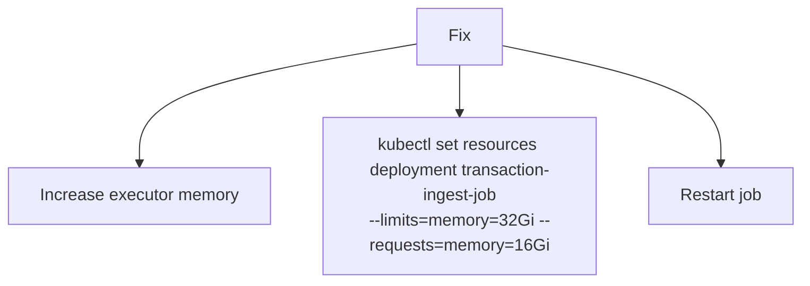
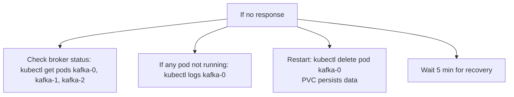
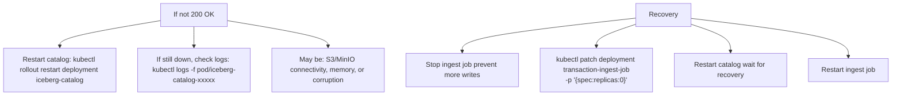
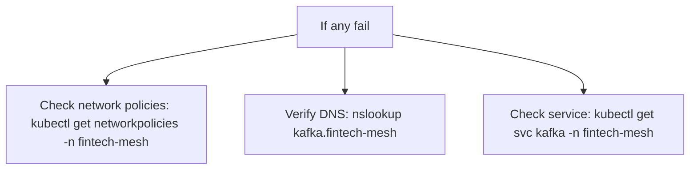
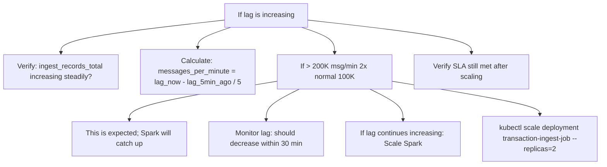
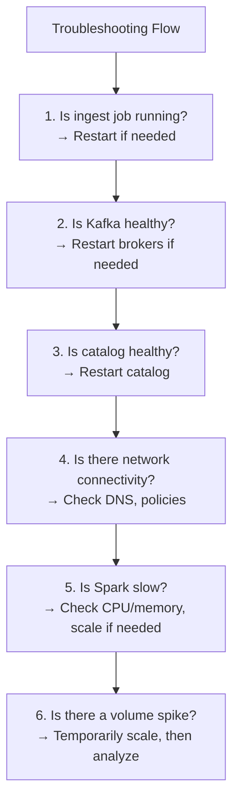
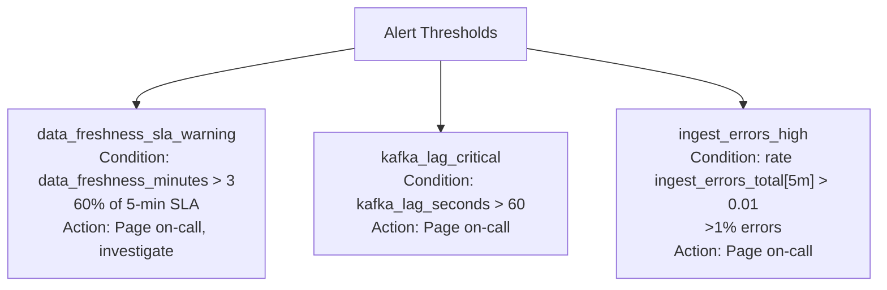
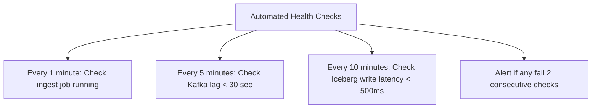

# Troubleshooting Guide: Common Issues and Solutions

Production incident response for fintech data mesh.

---

## Freshness SLA Violated (Data Lag > 5 minutes)

### Symptoms
- Metrics show: `data_freshness_minutes > 5`
- Alert fires: "Transactions freshness SLA violated"
- Analytics queries show stale data (5+ minutes old)

### Root Cause Diagnosis

```bash
# Step 1: Check if ingest job is running
kubectl get pods -n fintech-mesh -l app=transaction-ingest-job

# If not running:
kubectl logs -f pod/transaction-ingest-job-xxxxx -n fintech-mesh | tail -50

# Step 2: Check Kafka lag
kubectl exec -it pod/kafka-0 -- \
  kafka-consumer-groups.sh \
  --bootstrap-server kafka:9092 \
  --group transaction-ingest-consumer \
  --describe

# Output should show lag_per_partition and total_lag
# If lag > 1000 messages: Spark can't keep up

# Step 3: Check Spark metrics
curl http://localhost:4040/api/v1/applications
# Look for: lastTaskTime, totalCores in use, memory

# Step 4: Check Iceberg write time
# Query last 10 snapshots
kubectl exec -it pod/spark-driver -- spark-sql
> SELECT snapshot_id, committed_at, summary 
  FROM transactions.raw_transactions.history 
  LIMIT 10;

# If committed_at times are > 5 minutes apart: Spark job is slow
# If committed_at times are close: Issue is elsewhere
```

### Common Causes & Fixes

**Cause 1: Spark Job Crashed**

```bash
Check: kubectl logs -f pod/transaction-ingest-job
Error: java.lang.OutOfMemoryError: Java heap space
```



**Cause 2: Kafka Broker Down**

```bash
Check: kafka-topics.sh --bootstrap-server kafka:9092 --list
```



**Cause 3: Iceberg Catalog Slow**

```bash
Check: curl http://iceberg-catalog:8181/health
```



**Cause 4: Network Connectivity**

```bash
Check network connectivity between services:
kubectl run -it debug-pod --image=busybox -- sh

# Inside debug pod:
nc -zv kafka 9092              # Kafka
nc -zv iceberg-catalog 8181    # Catalog
nc -zv minio 9000              # MinIO
```



**Cause 5: High Volume Spike**

```bash
Check: Kafka lag metric should be &lt; 30 sec normally
```



### Resolution Steps Priority Order



### Prevention

**Alerting thresholds** (set in Prometheus):



**Health checks** (automated):


```

---

## Query Latency Spikes (P95 > 30 seconds)

### Symptoms
- Slow queries when joining across domains
- Queries to risk_compliance.fraud_scores are very slow
- Analytics dashboard timeout (30-second limit)

### Diagnosis

```bash
# Check Spark query metrics
curl http://localhost:4040/api/v1/applications/app_id/stages

# Look for:
├── Duration: How long stage took
├── Number of tasks: If > 10000, might be bottleneck
└── Shuffle read/write size: If > 10GB, network is slow

# Check Iceberg metrics
spark.sql("""
  SELECT table_name, 
         COUNT(*) as partition_count,
         SUM(file_size_bytes) / (1024*1024*1024) as size_gb
  FROM iceberg_metadata
  GROUP BY table_name
  ORDER BY partition_count DESC
""")

# If transactions has 1M+ partitions: Too many files to scan
# If fraud_scores has 100K+ partitions: Same issue
```

### Common Causes

**Cause 1: Too Many Files per Partition**
```
Issue: Iceberg table has too many small files
├── Instead of: 3 files × 500MB each per partition
├── Actual: 150 files × 10MB each per partition
└── Result: Metadata scan time >> data scan time

Check:
SELECT 
  partition,
  COUNT(*) as file_count,
  AVG(file_size_bytes) / (1024*1024) as avg_size_mb
FROM iceberg_metadata
GROUP BY partition
HAVING file_count > 20  -- Red flag

Fix: Compaction
├── kubectl run iceberg-compact --image=spark -- \
│   spark-submit compact-job.jar transactions.raw_transactions
└── Consolidate files: 3 per partition
```

**Cause 2: Skewed Partition Scan**
```
Issue: Query filters push down to one partition, but that partition has most data

Example:
SELECT * FROM transactions.raw_transactions
WHERE account_id = 'hot_account'  -- This account does 50% of all transactions

Check:
├── Query plan: EXPLAIN SELECT ... (look for PartitionFilters)
├── If single partition has > 50% of rows: Skewed

Fix:
├── Add secondary partition: [year, month, day, merchant_id]
└── Queries can now filter on merchant_id too
```

**Cause 3: Missing Column Pruning**
```
Issue: Query reads unnecessary columns from disk

Example:
SELECT transaction_id FROM transactions.raw_transactions

If Iceberg schema has 15 columns and query only needs 1:
├── Without column pruning: Read all 15 (slow)
├── With column pruning: Read only 1 (fast)

Verify Iceberg is doing pruning:
├── Spark log should show: [transaction_id] (only needed columns)
├── If not: Check Iceberg plugin version
```

**Cause 4: OPA Policy Evaluation Slow**
```
Issue: Policy evaluation adds latency to every query

Check:
├── OPA response time: curl -X POST http://opa:8181/v1/data/authz \
│   (should be < 50ms)
├── If > 100ms: OPA policies are complex

Fix:
├── Simplify policies: Remove unnecessary rules
├── Cache policy results: Store decisions for 1 hour
└── Evaluate only on sensitive columns (not all)
```

### Resolution Steps

1. **Check file count per partition** → Run compaction if needed
2. **Check query plan** → Verify column pruning
3. **Check OPA latency** → Simplify policies if needed
4. **Check for skew** → Repartition if needed
5. **Run ANALYZE TABLE** → Update Iceberg statistics

```bash
# Update table statistics (enables better query planning)
spark.sql("ANALYZE TABLE transactions.raw_transactions COMPUTE STATISTICS")

# Check statistics
spark.sql("""
  SELECT * FROM iceberg_table_metadata 
  WHERE table = 'transactions.raw_transactions'
""")
```

---

## Data Quality Issues (Quality Checks Failing)

### Symptoms
- Alert: "Quality check failure rate > 1%"
- Data arrives with negative amounts, null values, invalid statuses
- Downstream analytics produce incorrect results

### Diagnosis

```bash
# Check quality check metrics
curl http://prometheus:9090/api/v1/query \
  '?query=quality_checks_failed{domain="transactions"}'

# Which checks are failing?
spark.sql("""
  SELECT 
    rule_name,
    COUNT(*) as failure_count,
    (COUNT(*) / SUM(COUNT(*)) OVER()) * 100 as pct_of_failures
  FROM quality_check_results
  WHERE status = 'FAILED'
    AND timestamp > now() - INTERVAL 1 hour
  GROUP BY rule_name
  ORDER BY failure_count DESC
""")

# Examine failing records
spark.sql("""
  SELECT * FROM transactions.raw_transactions
  WHERE amount <= 0  -- Specific quality rule failure
  LIMIT 10
""")
```

### Common Causes

**Cause 1: Upstream Data Issue**
```
Issue: Payment processor sent invalid data

Example:
├── Negative transaction amounts (should be > 0)
├── Missing merchant_id (required field)
├── Invalid status (not in enum: PENDING, CLEARED, FAILED, REVERSED)

Check: Kafka source directly
├── kafkacat -b kafka:9092 -t market-transactions-raw -o -1 -n 10
├── Inspect raw messages for format issues
└── Contact upstream team (payment processor)

Temporary fix:
├── Add filter in ingest job: WHERE amount > 0
├── Mark invalid records as CORRUPTED
├── Manual review & correction
```

**Cause 2: Schema Mismatch**
```
Issue: Schema changed, parser throws errors

Example:
├── New field added: fraud_risk_score (was optional, now required)
├── Old events missing field → JSON parse fails
├── Records dropped silently or marked as FAILED

Check:
├── Review schema changes: git log -- domains/transactions/schemas/
├── Verify schema is backward compatible
├── Check ingest job logs: grep ERROR logs.txt

Fix:
├── Add default value for new optional fields: fraud_risk_score = NULL
├── If truly required: Backfill historical data
└── Restart ingest job with fixed schema
```

**Cause 3: Database Constraint Violation**
```
Issue: Data violates business rule (setup date > today)

Check: Quality rule definition
├── spark.sql("SELECT * FROM iceberg_table_metadata WHERE table = 'transactions'")
├── Review rule: booking_timestamp <= settlement_timestamp
└── Check: Are rule definitions correct?

Fix:
├── If rule is too strict: Relax rule (discuss with domain team)
├── If data is wrong: Correct upstream
└── If both: One-time fix for historical data
```

### Resolution Steps

1. **Identify failing rule** → Which quality check is failing?
2. **Find failing records** → Query records that violate the rule
3. **Investigate source** → Is it upstream data or rule definition?
4. **Implement fix** → Filter, schema change, rule adjustment
5. **Verify fix** → Re-run quality checks, confirm pass rate improves

### Monitoring

```yaml
# Quality check SLO
metric: quality_checks_passed_pct
definition: (checks_passed / (checks_passed + checks_failed)) * 100
target: > 99%
warning: < 99.5%
critical: < 99%

# Per-rule monitoring
├── positive_amount: Failure usually means upstream bug
├── valid_status: Usually schema or enum change
└── recent_timestamp: Usually infrastructure issue (clock skew)

# Action on failure
├── Alert: Notify domain team + on-call
├── Investigation: Check logs, upstream data
├── Remediation: Fix source, backfill if needed
└── Post-incident: Update checks to catch similar issues
```

---

## Governance & Access Control Issues

### Access Request Stuck in Approval (> SLA)

```bash
# Check approval status
curl http://localhost:8000/api/access-requests/req_12345

# If stuck > 4 hours:
├── Check: Does domain owner email exist? (typo?)
├── Check: Is email actually going through? (SMTP working?)
├── Check: Did owner mark as read?

# Manual override (use sparingly):
curl -X POST http://localhost:8000/api/access-requests/req_12345/approve \
  -H "Authorization: Bearer $ADMIN_TOKEN"
```

### PII Masking Not Applied

```bash
# Test masking rule
curl -X POST http://opa:8181/v1/data/authz \
  -d '{
    "input": {
      "user_role": "external_analyst",
      "column": "account_id",
      "classification": "pii"
    }
  }'

# Should return: apply_masking = true

# If not working:
├── Check OPA logs: kubectl logs -f pod/opa-0
├── Verify policy loaded: curl http://opa:8181/v1/data/authz
└── Reload policy: kubectl rollout restart deployment opa
```

### Audit Trail Missing

```bash
# Check Elasticsearch for query logs
curl http://elasticsearch:9200/query-audit-*/_search \
  -d '{"query": {"term": {"user_id": "analyst_42"}}}'

# If logs missing:
├── Check Elasticsearch health: curl http://elasticsearch:9200/_cluster/health
├── Check Spark logging: grep "AUDIT" driver.log
└── Verify Elasticsearch output is configured
```

---

## Infrastructure Issues

### Kafka Broker Crash

```
Symptom: One broker unresponsive, cluster degraded

Resolution:
1. Check status: kubectl get pods kafka-0, kafka-1, kafka-2
2. If one pod not ready: 
   kubectl describe pod kafka-0 | grep -i event
3. Restart broker:
   kubectl delete pod kafka-0 (PVC persists data)
4. Wait for it to rejoin cluster:
   kubectl logs -f kafka-0 | grep "Registered broker"
5. Verify cluster:
   kafka-broker-api-versions.sh --bootstrap-server kafka:9092
```

### MinIO S3 Storage Full

```
Symptom: Ingest job fails with "insufficient space"

Resolution:
1. Check storage: kubectl exec -it minio -- df -h
2. If > 90% full:
   - Delete old snapshots: 
     spark.sql("DELETE FROM transactions.raw_transactions 
               WHERE snapshot_id < OLD_SNAPSHOT_ID")
   - Compact files to reduce count
   - Add storage (scale MinIO PVC)
```

### Prometheus/Grafana Down

```
Symptom: Metrics not collected, dashboards offline

Resolution:
1. Check pods: kubectl get pods -l app=prometheus
2. If down: kubectl logs prometheus-0
3. Restart: kubectl rollout restart deployment prometheus
4. Verify: curl http://prometheus:9090/-/healthy

Note: This is non-critical (dashboards offline but data still flowing)
```

---

## Escalation Path

| Issue | Severity | Response Time | Owner |
|-------|----------|---------------|-------|
| Data freshness SLA violated | Critical | 5 min | On-call + Transactions Team |
| Query latency > 30 sec | High | 15 min | On-call + Query Performance Team |
| Quality check fail rate > 1% | High | 15 min | On-call + Data Quality Team |
| Access request stuck | Medium | 2 hours | Data Governance Team |
| Kafka broker down | Critical | 5 min | Infrastructure Team |
| Prometheus down | Low | 4 hours | Observability Team |

---

## Next

- **[Scaling Guide](scaling.md)** — Performance tuning and capacity planning
- **[Trade-offs](trade-offs.md)** — Understand design trade-offs
